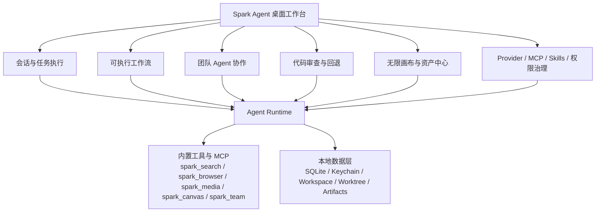
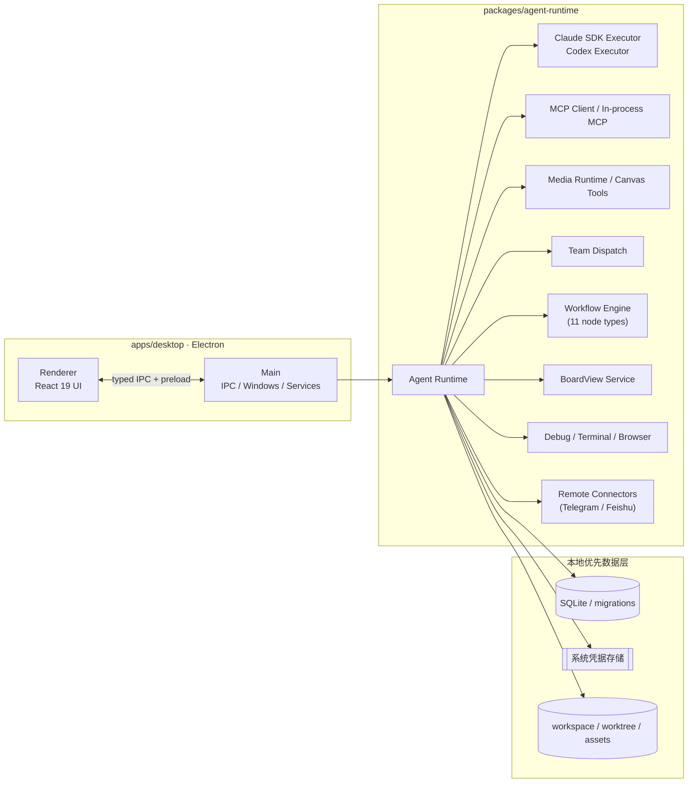

# Spark Agent

> 本地优先的桌面端 AI Agent 工作台——代码开发、办公文档、调研、多媒体影视创作、画布，一个助手，多种活儿都能推进。

[](#许可证)
[](apps/desktop)
[](apps/desktop)
[](tsconfig.base.json)
[](package.json)
[](#下载)

[官网](https://spark.yiqibyte.com) ·
[下载](#下载) ·
[文档](#文档) ·
[Roadmap](https://spark.yiqibyte.com/roadmap) ·
[更新日志](CHANGELOG.md)

---

Spark Agent 是一个基于 Electron 的双内核桌面Agent应用。它把多种内容开发、创作能力聚合进同一个工作台：你可以在这里和 Agent 一起改代码、调试、运行可复用工作流、跑多 Agent 团队任务、管理 Provider 与工具生态，或在无限画布上做内容创作。

所有数据默认留在本机——结构化数据存入 SQLite，敏感凭据进入系统钥匙串，工作区与产物保留在本地文件系统。**无需注册账号，也不依赖任何云端服务。**

> 项目处于快速开发阶段，API、数据结构与 UI 细节仍在持续调整。欢迎 Star / Issue / PR。

## 一眼看懂

### 你会怎么用它


### 产品结构



### 典型落地流程

1. 在会话里描述目标，或把目标做成可复用工作流。
2. 让 Agent 读取项目、运行命令、操作浏览器、调用搜索或媒体工具。
3. 在同一个工作台里检查终端输出、文件预览、Git diff、任务状态和生成结果。
4. 接受改动、继续迭代，或回退到 checkpoint 后重来。
5. 把稳定流程沉淀成 Agent、Skill、MCP 组合，交给自己或团队复用。

## 功能

Spark Agent 围绕四条主线组织能力，下图为整体全景，各主线详情见其后分节。

```mermaid
graph TB
    Core["Spark Agent<br/>本地优先 Agent 工作台"]
    Core --> Workflow["可执行工作流编排"]
    Core --> Dev["代码开发与调试"]
    Core --> Team["团队 Agent 协作"]
    Core --> Runtime["双内核与平台治理"]
    Core --> Canvas["无限画布内容创作"]

    Workflow --> W1["可视化节点 / 连线 / Inspector"]
    Workflow --> W2["input / plan / agent / approval / verify / review / artifact"]
    Workflow --> W3["workflow_run 真实执行 / workflow_runs 快照"]
    Workflow --> W4["失败恢复 / 审批暂停 / 工具能力收窄"]

    Dev --> D1["侧边聊天 / 内置终端 / 文件目录"]
    Dev --> D2["Git Review / HunkDiff / 代码还原点"]
    Dev --> D3["Debug 模式 / 浏览器自动化"]
    Dev --> D4["Worktree 隔离 / 远程连接"]

    Team --> T1["Host 调度 Member"]
    Team --> T2["成员级模型 / MCP / Skills"]
    Team --> T3["群聊式过程 / 预算 / 超时"]

    Runtime --> R1["Claude SDK + Codex 双内核"]
    Runtime --> R2["Provider / MCP / Skill 商店"]
    Runtime --> R3["权限审批 / 用量账本 / Hooks / 审计"]
    Runtime --> R4["任务面板 / 定时任务 / 上下文可视化"]

    Canvas --> C1["无限画布 / 资产中心"]
    Canvas --> C2["3D 导演台 / 360 场景预览 / Prompt Library"]
    Canvas --> C3["图片 / 视频 / 语音 AI 操作节点"]
    Canvas --> C4["血缘派生 / 画布专属助手"]
```



### 代码开发与调试

- 在你的真实项目里与 Agent 结对：读取 / 修改文件、执行命令、生成补丁、解释与重构代码、补齐测试；
- Debug 模式围绕“假设 → 插桩 → 运行 → 读日志 → 修复”闭环，配合 `spark_debug`、内置终端与持久日志定位问题；
- 右侧 Git Review 以 HunkDiff 逐块查看改动，可接受、拒绝、回滚，并在提交前验证；
- 代码还原点：每次关键改动都会保留 checkpoint、文件补丁与工作区状态，审查后不满意可一键恢复到稳定版本；
- Worktree 隔离：为会话创建独立工作树，Agent 在隔离分支作业，主工作区保持干净；
- 浏览器自动化（Playwright）：网页操作、验证与数据采集。

### 团队 Agent（A2A）

- Host Agent 通过 `spark_team` 调度多个成员 Agent，每个成员可独立配置模型、工具、Skills 与 MCP；
- 调度过程以群聊式 UI 呈现，可设成员级预算、超时与上下文上限；
- **成员间可互发消息**（`agent_message`：广播 / 定向 `call` / 异步 `note`），由 `enablePeerMessaging` 开启；多轮讨论有显式轮次状态机（`team_round_advance` / `team_conclude`），共享讨论线程跨 turn 持续；
- 支持 claude / codex 异构 adapter 混编（codex 成员经 HTTP 桥接获得等价工具面）；
- 支持成员级 MCP 工具、嵌套调用（`allowNesting` + `maxDepth`，最大 3），单 turn dispatch 预算（10）、peer call 独立预算（20/turn）、讨论消息总量上限（40）、超时（默认 120s）与取消传播。

### 双内核运行时与平台治理

- 双内核：Claude Agent SDK 与 Codex（CLI / OpenAI）可按会话、Agent 或任务切换执行路径；
- Provider / MCP / Skill 商店，Skill 采用渐进式披露，仅在需要时加载说明与脚本，避免上下文膨胀；
- 治理面：权限审批、用量账本、Rules、Hooks、审计事件与上下文可视化，便于复盘与管控；
- 任务面板（BoardView）聚合进行中 / 已完成 / 失败任务，6 个状态列（todo / in-progress / bug-fix / done / accepted / closed），支持拖拽、内联编辑、回收站软删除与 MCP 自动化；
- 远程连接（Telegram / 飞书）：本地 webhook（127.0.0.1:32178）桥接远程消息到默认会话，配对流程 + 内置命令（`/help` `/sessions` `/models` 等），跨设备保持上下文；
- 定时任务跑周期性工作流（巡检、日报、同步、脚本、内容生产）。

### 长期记忆系统

- 三层作用域隔离：**User（跨项目通用身份/偏好）/ Project（项目专属决策与背景）/ Agent（角色专属）**，记忆不会跨项目串味 —— 项目 A 的"独自开发"不会让项目 B 误读；
- **后台独立 LLM 抽取**（与 OpenAI Memory、Mem0 同款架构）：主对话不被"该不该记"打断，对话用强模型、记忆抽取走便宜小模型，成本最优且抽取故障不影响主流程；未配置抽取模型时自动回退到当前会话对话模型；
- 混合检索 + 会话自动注入：FTS5 关键词 + sqlite-vec 语义（RRF 融合 + 时间衰减），会话开始时把相关记忆摘要注入 system prompt，Agent 不调工具也能拿到历史上下文；
- 会进化：整合 job 把重复记忆自动合并（MERGE）、把零散反馈升华为通用模式（ELEVATE），越用越精炼而非越积越乱；
- Agent 按需深挖工具 `mcp__spark_memory__search_memory` / `recall_memory`（Claude SDK / Codex CLI / Claude CLI 路径注册）；
- 敏感词闸门 + bi-temporal 失效链；项目级正文 markdown 跟随项目代码目录存储。

### 可执行工作流编排（Visual Workflow Editor）

- 把多步任务（代码修复、调研、发布前自检、内容生产等）拆成「节点 + 连线」，让非技术用户也能像搭积木一样配置流程；
- Claude SDK 路径通过 `workflow_run` 真实驱动可执行节点，不再只是把步骤写进提示词；Codex 路径会按结构化执行计划推进；
- 支持 11 种节点：`input / plan / agent / subagent / skill / tool / mcp / approval / verify / review / artifact`；
- `agent` / `subagent` 节点可派发专属 Agent；`input` / `approval` / `verify` 等节点由系统侧稳定执行；
- `toolIds`、`skillIds`、`mcpServerIds` 可按节点收窄能力，`plan` / `input` / `review` 默认只读，真正编辑代码放在执行节点里；
- `workflow_runs` 记录运行快照、已完成节点、失败节点和恢复信息，适合审计、复盘与中断后继续；
- 常用模板：程序编码开发 `input → plan → approval → agent → verify → review → artifact`，调研报告 `input → plan → skill → mcp → review → artifact`，发布自检 `input → agent → verify → approval → review → artifact`；
- 面向客户的完整配置教程见[工作流编排文档](https://spark.yiqibyte.com/docs/workflow-usage)。

### 无限画布内容创作

- 多画布、多节点、多任务队列：文本、Prompt、图片、视频与素材在画布上编排、连接与派生；
- 资产中心沉淀剧本、角色、场景、道具、分镜、提示词库与生成产物；
- 3D 导演台配置角色、相机、视角、运动与构图，并转换为可生成的镜头描述；360° 预览多角度检查一致性；
- 内置 AI 操作节点：文生图、图生图、图片编辑、多图合成、文生视频、图生视频、语音合成；
- 画布专属助手：在画布上下文内拆解任务、创建节点、调度模型、检查结果并继续派生。

### 内置 14 个 Skill 与在线交付

- 应用内置 14 个 Skill：`claude-api / commit / react / frontend-design / skill-creator / multi-search-engine / browser-use / canvas-studio / spark-web-tool / echarts / ui-ux-pro-max / spark-debug / find-skills / platform-manager`，按需加载，渐进披露；
- `spark-web-tool` 直接在会话里生成 HTML 在线幻灯片与定制网页，支持导出 PPTX / DOCX / Markdown 等多种交付物；
- `platform-manager` 让 Agent 自动操作任务面板、Provider / Skill / Agent 管理；`spark-debug` 调试模式 + 日志分析；`multi-search-engine` 与 `browser-use` 配合搜索 + 浏览器自动化闭环。

## 快速开始

### 环境要求

- Node.js ≥ 22
- pnpm ≥ 10
- Git

Windows 用户建议安装 Visual Studio Build Tools，以便 `better-sqlite3`、`keytar` 等原生依赖在需要时正确构建。

### 从源码运行

```bash
git clone https://github.com/alexanderizh/spark-agent.git
cd spark-agent
pnpm install
pnpm dev          # 启动桌面端开发环境（renderer HMR，main/preload 自动重启）
```

开发模式使用独立的 `Spark Canvas Dev` userData，避免热重载时与正式安装版争用数据库。
如需指定其他开发数据根目录，可设置绝对路径环境变量 `SPARK_CANVAS_DEV_APP_DATA`。
修改 TypeScript/TSX、内置 runtime tools 或新增数据库 migration 后会自动触发对应的热更新；
修改原生依赖、`package.json` 或 Electron 版本后仍需重新安装/重建并重启开发进程。

常用脚本：

```bash
pnpm typecheck    # 类型检查
pnpm test:unit    # 运行单元测试
pnpm test         # 运行全部测试
pnpm lint         # 代码检查
pnpm format       # 格式化
pnpm build        # 构建桌面端
```

桌面端跨平台打包（位于 `apps/desktop/package.json`）：

```bash
pnpm --filter @spark/desktop build:win
pnpm --filter @spark/desktop build:mac
pnpm --filter @spark/desktop build:linux
```

### 下载

不想自行构建？直接使用已发布版本：[GitHub Releases](https://github.com/alexanderizh/spark-agent/releases)

- macOS（Apple Silicon / Intel，DMG）
- Windows（x64，安装包与便携版）
- Linux（AppImage / deb）

## 架构



### 内置 MCP / 工具

| 命名空间 | 能力 |
| --- | --- |
| `spark_search` | 供应商无关联网搜索（web_search / fetch_url），免密默认链 + keyed 后端（Bing / 百度 / DuckDuckGo / 博查 / Tavily / Serper）。 |
| `spark_media` / `spark_image` | 图片 / 视频 / 语音生成与编辑，统一路由到 Provider 适配器（APIMart / xAI / 火山 / 百炼 / 可灵 / Hailuo 等）。 |
| `spark_canvas` | 无限画布节点、任务、产物与项目上下文操作；lineage 派生边回写。 |
| `spark_team` | A2A 团队成员调度、事件流、嵌套调用、成员级预算与超时。 |
| `spark_debug` | 调试模式插桩、日志收集与分析。 |
| `spark_platform` | 平台管理：Agent / Skill / Provider / Rules / Permissions CRUD。 |
| `spark_board`（任务面板） | 看板任务增删改、状态流转、回收站与多维筛选，支持 Agent 自动操作。 |
| `spark_web`（spark-web-tool） | HTML 在线幻灯片与定制网页生成，支持导出 PPTX / DOCX / Markdown。 |
| `playwright` + `spark_browser` | `playwright` 负责标准网页自动化；`spark_browser` 提供应用内可见浏览器窗口、console/network 观测、元素读取与 profile 管理。 |

## 仓库结构

```text
.
├── apps/
│   ├── desktop/          # Electron 桌面应用（renderer + main）
│   │   └── resources/skills/  # 随包内置的 14 个 Skill（只读）
│   ├── server/           # 服务端子项目（认证 / 云同步，实施中）
│   └── website/          # 官网与用户文档
├── packages/
│   ├── agent-runtime/    # Agent Runtime、双内核、Provider、MCP、媒体、团队、调试
│   ├── protocol/         # IPC、事件协议、Zod schemas（含 BUILTIN_MEDIA_MODEL_MANIFESTS）
│   ├── shared/           # 通用工具、日志、错误、KeyStore
│   └── storage/          # SQLite 存储、迁移、Repository
└── docs/                 # 架构、设计、发布和开发文档
```

## 技术栈

- **桌面框架**：Electron、electron-vite、electron-builder
- **前端**：React 19、TypeScript、Tailwind CSS、@lobehub/ui、antd、XYFlow
- **运行时**：Node.js、Claude Agent SDK、Codex CLI / OpenAI、MCP、Provider / Media Adapter
- **数据与安全**：SQLite / better-sqlite3、keytar、workspace / worktree、本地文件协议
- **工程化**：pnpm workspace、Vitest、Playwright、ESLint、Prettier

## 文档

官网维护面向最终用户的完整文档：

- 文档首页：[https://spark.yiqibyte.com/docs](https://spark.yiqibyte.com/docs)
- 快速开始：[https://spark.yiqibyte.com/docs/quick-start](https://spark.yiqibyte.com/docs/quick-start)
- 代码开发：[https://spark.yiqibyte.com/docs/code-development](https://spark.yiqibyte.com/docs/code-development)
- Agent 工作流：[https://spark.yiqibyte.com/docs/agents-workflows](https://spark.yiqibyte.com/docs/agents-workflows)
- 团队模式（A2A）：[https://spark.yiqibyte.com/docs/team-mode](https://spark.yiqibyte.com/docs/team-mode)
- 工作流编排：[https://spark.yiqibyte.com/docs/workflow-usage](https://spark.yiqibyte.com/docs/workflow-usage)
- 无限画布：[https://spark.yiqibyte.com/docs/canvas-mvp](https://spark.yiqibyte.com/docs/canvas-mvp)
- 多媒体 Provider：[https://spark.yiqibyte.com/docs/media-providers](https://spark.yiqibyte.com/docs/media-providers)
- 图片生成 Provider：[https://spark.yiqibyte.com/docs/image-providers](https://spark.yiqibyte.com/docs/image-providers)
- 联网搜索（spark_search）：[https://spark.yiqibyte.com/docs/web-search](https://spark.yiqibyte.com/docs/web-search)
- 浏览器自动化（Playwright + spark_browser）：[https://spark.yiqibyte.com/docs/browser-automation](https://spark.yiqibyte.com/docs/browser-automation)
- 远程连接（Telegram / 飞书）：[https://spark.yiqibyte.com/docs/remote-connections](https://spark.yiqibyte.com/docs/remote-connections)
- 自动更新：[https://spark.yiqibyte.com/docs/auto-update](https://spark.yiqibyte.com/docs/auto-update)
- MCP 与 Skills：[https://spark.yiqibyte.com/docs/mcp-skills](https://spark.yiqibyte.com/docs/mcp-skills)
- 内置工具（14 个 Skill）：[https://spark.yiqibyte.com/docs/builtin-tools](https://spark.yiqibyte.com/docs/builtin-tools)
- 权限与治理：[https://spark.yiqibyte.com/docs/governance](https://spark.yiqibyte.com/docs/governance)
- 任务面板（BoardView）：[https://spark.yiqibyte.com/docs/board-view](https://spark.yiqibyte.com/docs/board-view)
- 桌面端架构：[https://spark.yiqibyte.com/docs/desktop-guide](https://spark.yiqibyte.com/docs/desktop-guide)

仓库内 [`docs/`](docs) 目录保留面向开发者的设计与实现文档，包括：

- [Desktop Agent Development Guide](docs/desktop-agent-development-guide.md)
- [Agents Workflows](docs/agents-workflows.md)
- [团队模式开发（Team Agent Mode）](docs/团队模式开发.md)
- [AI 无限画布 MVP](docs/ai-infinite-canvas-mvp.md)
- [多媒体模型 Provider](docs/multimedia-model-providers.md)
- [图片生成 Provider](docs/image-generation-providers.md)
- [内置联网搜索](docs/builtin-web-search.md)
- [MCP / Skills 实现](docs/builtin-installable-skills.md)
- [浏览器自动化 Skill](docs/skills/browser-automation.md)
- [Remote Connections](docs/remote-connections.md)
- [GitHub Release Auto Update](docs/github-release-auto-update.md)

## 贡献

欢迎通过 Issue 与 Pull Request 参与贡献。适合贡献的方向包括：

- 代码开发体验、调试模式、Worktree 隔离、代码审查
- 团队模式（Host / Member 调度、事件流、预算与超时、嵌套调用）
- 工作流编排（节点类型、Inspector、模板与执行计划）
- 任务面板（BoardView 状态机、回收站、MCP 自动化）
- 双内核执行（Claude Agent SDK / Codex）
- MCP / Skill 生态与渐进式披露
- 无限画布、媒体 Provider、3D 导演台、360 全景预览
- 远程连接（Telegram / 飞书）、定时任务、审计与治理
- 跨平台打包、CI 与自动化测试

提交前请确保本地检查通过：

```bash
pnpm typecheck && pnpm lint && pnpm test
```

## 安全

如果你发现安全问题，请**不要**在公开 Issue 中披露敏感细节。先通过仓库维护者可用的私有联系方式沟通，确认影响范围后再公开修复说明。

## 许可证

本项目采用基于 Apache License 2.0 的个人使用许可证，详见 [LICENSE](LICENSE)。
个人学习、研究、评估和自用可以使用、复制、修改和分发；任何商业用途、公司/机构内部使用、为客户交付、付费服务或商业产品集成都需要先获得维护者书面授权。

注意：该许可证附加了个人使用限制，并非标准 SPDX `Apache-2.0` 许可证。

---

<sub>Built with Electron · React · TypeScript · pnpm.</sub>
