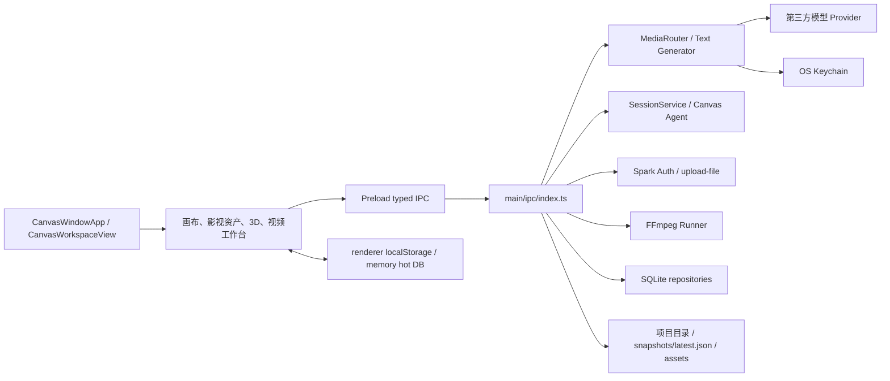

# Spark Canvas 独立化架构与功能审计

> 状态: 实施中 | 最后核对: 2026-07-20

## 1. 文档目的

本文件是 Spark Canvas 从完整 `spark-agent` 平台中独立出来的总控基线，负责回答五件事：

1. 当前仓库实际上包含什么。
2. 画布和视频生产链已经具备什么能力。
3. 哪些旧 Agent 平台能力仍与画布耦合。
4. 哪些模块应保留、精简、替换、移除或等待产品决策。
5. 独立化应按什么顺序实施和验收。

审计与范围冻结已完成，当前进入分批实施；本文仍是模块去留和验收的总控基线。产品定位已于 2026-07-16 确认为“AI 影视/短剧生产工作台”，Canvas Agent 已确认作为第一版核心保留；负责人于 2026-07-17 确认采用 BYOK + 官方托管混合模式并完全共用 Spark 云账户，同时确认新应用全新开始、不自动迁移旧 Spark 本地数据。正式产品名 `Spark Canvas` 及 appId、URL scheme、本地凭据 namespace 已冻结；生产签名已选择在同一合法发行主体且证书可用的前提下复用原生产身份，其余发布基础设施仍按决策门验收。

审计基线：

- 仓库提交：`6cfbfcd Copy full spark-agent monorepo into Spark-Canvas`
- 根包名：`spark-agent`
- 桌面端版本：`0.5.1`
- 审计方式：源码、测试、配置、IPC、数据库迁移和 Git 历史直接核对
- GitNexus：当前可用索引不对应本仓库，按项目降级规则改用源码、`rg`、测试和 `git diff`
- 源码依赖切片：[`2026-07-16-canvas-standalone-dependency-slice.md`](../reviews/2026-07-16-canvas-standalone-dependency-slice.md)
- 模块处置总账：[`2026-07-16-canvas-module-disposition-ledger.md`](../reviews/2026-07-16-canvas-module-disposition-ledger.md)
- 旧身份、云服务与本地数据耦合：[`2026-07-16-canvas-identity-cloud-coupling.md`](../reviews/2026-07-16-canvas-identity-cloud-coupling.md)
- 共享 Spark 云、计费与上传契约：[`2026-07-17-canvas-shared-spark-cloud-contract.md`](../reviews/2026-07-17-canvas-shared-spark-cloud-contract.md)
- 数据权威、空库启动与项目包：[`2026-07-17-canvas-data-authority-bootstrap.md`](../reviews/2026-07-17-canvas-data-authority-bootstrap.md)
- 签名、发布与更新链：[`2026-07-17-canvas-release-signing-readiness.md`](../reviews/2026-07-17-canvas-release-signing-readiness.md)
- 运行时、凭据与 FFmpeg 边界：[`2026-07-17-canvas-runtime-security-boundary.md`](../reviews/2026-07-17-canvas-runtime-security-boundary.md)
- 不可达模块逐文件处置：[`2026-07-17-canvas-unreachable-module-disposition.md`](../reviews/2026-07-17-canvas-unreachable-module-disposition.md)
- 旧平台删除和发布安全门：[`2026-07-17-canvas-platform-removal-release-gates.md`](../reviews/2026-07-17-canvas-platform-removal-release-gates.md)
- 发行决策就绪：[`2026-07-17-canvas-release-decisions-readiness.md`](../reviews/2026-07-17-canvas-release-decisions-readiness.md)
- 资源来源、许可与发布门：[`2026-07-17-canvas-resource-provenance-release-gates.md`](../reviews/2026-07-17-canvas-resource-provenance-release-gates.md)
- 审计覆盖与决策：[`2026-07-17-canvas-standalone-audit-coverage.md`](../reviews/2026-07-17-canvas-standalone-audit-coverage.md)
- 已确认范围基线：[`2026-07-16-ai-film-workbench-scope-freeze.md`](./2026-07-16-ai-film-workbench-scope-freeze.md)

当前实施证据：Canvas-only 主壳已只保留“项目、模型服务、账户、设置”四个一级入口；独立 Canvas 窗口继续挂载共享 Spark 登录所需的 `AuthProvider`，但已移除 `SessionSidebarProvider`。Canvas Agent 会话创建、列表和 created stream 已按 `surface: 'canvas'` 隔离；画布文本入口和后端只允许内置 Canvas Assistant，数据库 migration 055 也将其设为唯一默认 Agent，同时保留既有会话的显式 `agent_id`。managed Skills 已收口为 4 个批准项，`skill:list` 只读并过滤返回集合。Desktop IPC 已由共享 policy 精确收口为 115 个 invoke 与 14 个 stream，main/preload 双侧 fail closed，最新运行态 115 个注册 handler 与 policy 完全一致且旧平台域为 0；Terminal 与 GitHub Connector 注册入口已移除。Scheduled Task/Task Execution 已作为首个旧平台域完成全纵向物理删除：专属 UI、15 个 invoke、1 个 stream、main service/executor、protocol/types/export schema、runtime/storage exports 和两个 Repository 均已移除；migration 024 暂留到 Canvas 最小数据库基线单独落地。Provider vault 启动迁移与失败传播、per-project revision/dirty 保存保护、原子快照写入、v3 目录项目包与 legacy v1/v2 bridge、`spark_media` 两个打包 helper、102 项媒体目录校验和 Windows stable 签名 Gate 也已落地。画布输入 `auto` 已默认本地 base64，显式 `cloud_url` 才上传图片/音频/视频；媒体任务数据库不再持久化输入 URL/data URL/本地路径，Provider 原始响应与请求诊断也进入脱敏边界。D-016 已完成：workspace 只包含 `apps/desktop` 与 `packages/*`，lockfile 已移除 Website importer，旧发布 workflow 已删除；`apps/website` 源码暂留但不进入 workspace/CI，并有边界测试防回归。未完成项仍是其余旧 IPC/Protocol/Service/Storage 源码的逐域物理删除、版本中心 v2 服务端 schema、对象复验与事务 promote、受信 FFmpeg 制品及合规证据、Canvas 最小数据库基线、真实 Provider/Provider 原生上传、上传 `fileKey` 生命周期、支付幂等，以及三平台生产签名安装验收。详细状态以范围冻结文档的“当前实施快照”为准。

## 2. 处置标签

| 标签     | 含义                                                         |
| -------- | ------------------------------------------------------------ |
| 保留     | 独立视频画布的核心能力，独立化期间不得误删                   |
| 精简保留 | 能力需要，但当前实现混入旧平台职责，应缩小到视频画布所需范围 |
| 替换     | 业务能力需要，但旧品牌、未批准云服务或旧技术路径不能直接沿用 |
| 移除     | 与独立视频画布无关，完成解耦后删除                           |
| 二期     | 有价值但不是第一版独立化的阻塞项，先保持可用、不继续扩写     |
| 待确认   | 取决于静态接管证据、品牌、官网或许可，未经确认不能删除       |

## 3. 执行摘要

### 3.1 产品主壳与 workspace/CI 已独立，旧源码仍待逐域收缩

桌面产品入口已经切换为 Canvas-only 主壳，workspace/CI 也已与旧官网断开；旧 Agent 平台与官网源码仍暂留在仓库：

```text
Spark-Canvas/
├── apps/desktop          Electron + React 19 桌面 Agent 平台和 Canvas
├── apps/website          原 Spark Agent 官网源码，仅留档，不属于 workspace/CI
├── packages/agent-runtime
│                         Agent Session、Claude/Codex、MCP、Skill、Memory、
│                         Workflow，以及 Canvas 文本/媒体运行时
├── packages/protocol     全平台 IPC、事件和数据协议
├── packages/storage      全平台 SQLite 仓储和 55 个迁移
└── packages/shared       日志、错误、Keychain、共享 Spark 资产 URL 等能力
```

当前桌面主导航只有“项目、模型服务、账户、设置”；旧 Chat、Agents、Teams、Workflow、Board、MCP、Skill Store、Memory、浏览器等页面和底层运行时仍留在仓库，部分继续被 Canvas Agent 闭包引用。`pnpm-workspace.yaml` 只包含 `apps/desktop` 与 `packages/*`，lockfile 不再有 Website importer，`.github/workflows/publish-website.yml` 已删除；`legacy-website-boundary.test.ts` 同时保护 workspace 和 workflow 边界。旧 `apps/website` 目录仍保留，后续可独立重建或删除，但已经无法被当前 workspace/CI 误构建、误发布。

### 3.2 画布已经是完整产品域

画布不是一个简单页面。它已经有独立 `BrowserWindow`、项目管理、无限画布、影视资产中心、AI 生成任务、3D 导演台、视频工作台、项目目录和 SQLite 快照。合理拆分单位是：

```text
画布产品 UI
+ 影视生产领域模型
+ 文本/图片/音频/视频模型运行时
+ Provider、BYOK 凭据与共享 Spark 云账户
+ 项目文件与 SQLite
+ FFmpeg
+ Electron 安全壳、更新和日志
```

只复制 `renderer/design/views/canvas` 或只隐藏侧边栏都不构成独立产品。

### 3.3 已确认产品定位

负责人已于 2026-07-16 选择以下定位：

> AI 影视/短剧生产工作台：项目 -> 文稿/剧本 -> 角色与场景 -> 分镜 -> 关键帧 -> AI 视频 -> FFmpeg 后处理。

另外两种定位的影响：

| 方向                   | 与现状匹配度 | 影响                                                                       |
| ---------------------- | ------------ | -------------------------------------------------------------------------- |
| AI 影视/短剧生产工作台 | 高，已确认   | 现有影视资产、Style Bible、分镜、3D 预演和视频链可直接成为主流程           |
| 通用 AI 多媒体画布     | 中           | 影视能力应降为可选工作区，通用模板和更多非影视工作流要保留                 |
| 传统视频剪辑器         | 低           | 当前缺少成熟多轨时间线、音频混音、字幕编辑和整片交付，不是“拆出来”即可完成 |

以下保留/移除建议正式按第一种定位冻结；另外两种方向只保留为决策记录，不再作为当前实施范围。

### 3.4 三种定位的逐域范围差异

以下矩阵说明产品定位会改变哪些功能的优先级。`核心` 表示必须进入主流程，`可选` 表示保留为非默认工作区或二期工具，`弱化` 表示只留下底层能力，`重建` 表示现有实现不足以支撑该定位。

| 能力域                           | AI 影视/短剧工作台       | 通用 AI 多媒体画布 | 传统视频剪辑器             |
| -------------------------------- | ------------------------ | ------------------ | -------------------------- |
| 项目、Board、无限画布            | 核心                     | 核心               | 可选前期策划区             |
| 文稿、剧本、角色、场景、道具     | 核心                     | 可选影视模板       | 弱化或移除                 |
| Style/Production Bible           | 核心一致性机制           | 可选项目风格预设   | 弱化                       |
| 分镜、关键帧和影视流水线         | 核心                     | 可选影视工作流     | 可选前期工具               |
| 15 个文本/图片/音频/视频操作契约 | 核心                     | 核心               | 辅助生成能力               |
| 通用资产库                       | 影视资产中心             | 泛媒体素材库       | 媒体 Bin，需要重做交互     |
| 2D/3D 导演台和 360 全景          | 二期差异化能力           | 可选创作工具       | 非核心，可移除             |
| 当前视频工作台和 FFmpeg          | 核心后处理               | 核心媒体处理       | 仅是底座，编辑器主体需重建 |
| DOCX/XLSX 等文档输入             | 保留影视文稿路径         | 扩大通用格式支持   | 弱化为字幕/脚本辅助        |
| Canvas Agent                     | 第一版核心，保留当前实现 | 二期精简或移除     | 非核心                     |
| 旧 Chat/Team/Workflow/MCP 等平台 | 移除                     | 移除               | 移除                       |

三种方向需要补的产品能力不同：

| 方向                   | 现有代码复用度 | 主要新增投入                                                                  | 风险 |
| ---------------------- | -------------- | ----------------------------------------------------------------------------- | ---- |
| AI 影视/短剧生产工作台 | 高             | 对白配音、BGM/音效、字幕编排、镜头装配、整集导出和跨镜一致性验收              | 中   |
| 通用 AI 多媒体画布     | 中             | 通用模板体系、非影视资产模型、更多工作流入口、领域无关文案和更广文件格式      | 中高 |
| 传统视频剪辑器         | 低             | 多轨时间线、音频混音、关键帧动画、转场/特效、代理媒体、素材管理和完整导出引擎 | 高   |

已冻结的第一版核心包括：Electron 安全壳、Canvas 项目/Board/编辑器、影视资产与流水线、项目资产目录、BYOK Provider/Keychain、共享 Spark 账户与托管模型、文本与媒体任务、基础 FFmpeg、Canvas Agent 当前实现、精简设置、日志和更新。2D/3D 导演台、360 全景等影视差异化能力保留为二期。旧 Agent 平台产品域不再作为主产品能力，但 Canvas Agent 当前闭包和已批准的 Spark Auth、Platform Model、Usage、支付、上传服务作为首版例外保留。

## 4. 当前架构和数据流



### 4.1 已有独立边界

- `CanvasWindowService` 为每个项目打开独立窗口。
- `CanvasWindowApp` 可绕过主导航直接渲染工作区。
- 独立窗口只保留共享 Spark 账户所需的 `AuthProvider`，不再挂载 `SessionSidebarProvider`，打开画布不会再由侧栏 Provider 触发旧 Session/Workspace/Terminal 初始化。
- 画布数据已有独立项目表、快照表和项目目录。
- 画布媒体生成有独立 IPC、任务运行时、模型清单和 Adapter。
- 视频处理有独立 FFmpeg Runner 和路径白名单。

### 4.2 尚未独立的边界

- 独立窗口仍包裹 `AuthProvider`；这是已批准的共享 Spark 账户边界，但登录 bootstrap 失败不得阻塞 BYOK 和本地项目。
- 画布 Agent 直接依赖 Session、Agent、Skill、MCP 和 Claude/Codex 执行器。
- Provider 页面同时服务代码 Agent、文本模型和多媒体模型。
- Canvas IPC 与全平台 IPC 混在一个 7775 行文件。
- `@spark/protocol`、`@spark/storage` 和 `@spark/agent-runtime` 都包含大量无关平台能力。
- 图生视频的 `cloud_url` 输入依赖已批准共用的 Spark 登录与上传服务。
- 应用名、appId、URL scheme、本地数据与凭据 namespace 已切为 Spark Canvas；仍待收口的是旧源码文案/链接、版本中心 v2 服务端 promote、官网重建和三平台正式发行证据。

## 5. 现有画布功能全量清单

功能口径以当前产品入口可达实现为准。2026-07-17 的静态切片基线是 173 个 Canvas TS/TSX 生产模块，其中 158 个可从 `main.tsx`、`App.tsx` 或 `CanvasWindowApp.tsx` 到达、15 个不可达；后续新增和接管模块后不再把该数字表述为当前实时计数，下一次结构拆分前应重跑同一 TypeScript AST 扫描。T-009 已逐文件冻结为 4 个删除、4 个直接接管、3 个更新后接管、4 个保留并接入；其中 Board 导航和 Production Panel 是尚未接线的产品能力，连线语义模块还揭示了现有 `generated` 血缘错误，不能再把整组概括为重复 helper。详见[不可达模块逐文件处置审计](../reviews/2026-07-17-canvas-unreachable-module-disposition.md)。

### 5.1 项目管理

| 现有能力                       | 状态                                    | 第一版建议                   |
| ------------------------------ | --------------------------------------- | ---------------------------- |
| 新建项目、名称、描述           | 已实现                                  | 保留                         |
| 自定义项目父目录和独立项目目录 | 已实现                                  | 保留                         |
| 项目封面上传、移除、列表展示   | 已实现                                  | 保留                         |
| 搜索项目                       | 已实现                                  | 保留                         |
| 按更新时间、名称等排序和升降序 | 已实现                                  | 保留                         |
| 项目置顶/取消置顶              | 已实现                                  | 保留                         |
| 归档/恢复                      | 已实现                                  | 保留，但需补真实归档视图验收 |
| 打开项目文件夹                 | 已实现                                  | 保留                         |
| 单 JSON 导出                   | 已实现，主要内嵌图片                    | 精简保留，需补音视频可移植性 |
| 目录项目包导出                 | 已实现，复制项目 assets                 | 保留                         |
| JSON 文件导入                  | 已实现                                  | 保留                         |
| 目录项目包导入                 | v3 入口已实现；另有 legacy v1/v2 bridge | 保留并持续做可移植性验收     |
| 删除项目                       | 普通删除已保留磁盘目录                  | 保留                         |
| 旧资源迁移到项目目录           | 已实现                                  | 仅用于用户主动导入的项目     |
| 孤儿项目/资源清理              | 已实现                                  | 保留为维护工具               |
| 独立项目窗口                   | 已实现                                  | 保留，改为主产品窗口模式     |

### 5.2 多画板与项目组织

| 现有能力                         | 状态            | 第一版建议                           |
| -------------------------------- | --------------- | ------------------------------------ |
| 一个项目多个 Board               | 已实现          | 保留                                 |
| 新建、重命名、复制、删除 Board   | 已实现          | 保留                                 |
| Board 排序                       | 已实现          | 保留                                 |
| 设置默认 Board                   | 已实现          | 保留                                 |
| Board 封面                       | 数据能力已实现  | 保留                                 |
| Board 网格、吸附、背景和主题设置 | 已实现/部分预留 | 保留网格吸附，删除无 UI 消费的预留项 |
| 跨 Board 复制节点                | 已实现          | 保留                                 |
| 按章节/剧集关联 Board            | 数据模型已实现  | 保留并纳入影视主流程                 |
| Board 视口记忆                   | 已实现          | 保留                                 |

### 5.3 无限画布编辑

| 现有能力                                       | 状态   | 第一版建议                   |
| ---------------------------------------------- | ------ | ---------------------------- |
| 无限平移、缩放、适配全部、回到选中节点         | 已实现 | 保留                         |
| 选择/平移工具切换                              | 已实现 | 保留                         |
| 单选、框选、多选                               | 已实现 | 保留                         |
| 节点拖动、缩放、旋转、层级                     | 已实现 | 保留                         |
| 网格显示和吸附                                 | 已实现 | 保留                         |
| 对齐参考线                                     | 已实现 | 保留                         |
| 左/右/上/下/水平居中/垂直居中对齐              | 已实现 | 保留                         |
| 水平/垂直分布                                  | 已实现 | 保留                         |
| 置顶/置底                                      | 已实现 | 保留                         |
| 锁定、隐藏                                     | 已实现 | 保留                         |
| 复制、批量复制、删除                           | 已实现 | 保留                         |
| 创建组、加入组、移出组、解散组                 | 已实现 | 保留                         |
| 组内自动布局和组尺寸刷新                       | 已实现 | 保留                         |
| 横向、纵向、宫格自动整理                       | 已实现 | 保留                         |
| 小/中/大/超大布局间距                          | 已实现 | 保留                         |
| 撤销/重做                                      | 已实现 | 保留                         |
| 快捷键帮助和键盘操作                           | 已实现 | 保留                         |
| 手动保存、自动保存、脏状态、离开保护、放弃更改 | 已实现 | 保留并做恢复测试             |
| 节点连线、删线、来源关系                       | 已实现 | 保留                         |
| 节点上下文菜单和浮动工具条                     | 已实现 | 保留，后续按影视流程收敛菜单 |

### 5.4 节点、连线和内容

当前基础节点：

- 文本
- Prompt
- 图片
- 音频
- 视频
- 组
- 15 个 AI 操作运行契约 ID；入口暴露集合存在差异
- 旧 `task` 节点只做兼容读取

当前连线语义：

- `derived_from`
- `used_as_input`
- `generated`
- `group_contains`
- `references`

当前内容能力：

| 现有能力                                                   | 状态       | 第一版建议               |
| ---------------------------------------------------------- | ---------- | ------------------------ |
| 纯文本和 Markdown 渲染                                     | 已实现     | 保留                     |
| Prompt 专用编辑                                            | 已实现     | 保留                     |
| 节点双击编辑和检查器                                       | 已实现     | 保留                     |
| 图片/音频/视频本地预览                                     | 已实现     | 保留                     |
| 图片尺寸和媒体尺寸自适应                                   | 已实现     | 保留                     |
| 图片标注：矩形、椭圆、箭头、画笔、马赛克、文字、橡皮、裁切 | 已实现     | 二期保留                 |
| 4/9/16/25 宫格及自定义行列切图                             | 已实现     | 保留，直接服务分镜图拆分 |
| 360 等距柱状图全景查看                                     | 已实现     | 二期保留                 |
| 资产/任务产物展开为普通节点                                | 已实现     | 保留                     |
| 候选产物、集合产物、主产物手动选择                         | 已实现     | 保留                     |
| 节点生产状态 empty/drafting/draft/confirmed/stale          | 已实现     | 保留并补 UI 一致性验收   |
| 上游变化导致下游 stale                                     | 已实现     | 保留                     |
| 节点版本号和人工编辑标记                                   | 数据已实现 | 保留，避免继续堆预留字段 |

### 5.5 外部文件输入

| 类型                                             | 当前行为                                       | 第一版建议                           |
| ------------------------------------------------ | ---------------------------------------------- | ------------------------------------ |
| 图片 PNG/JPEG/GIF/WebP/BMP/SVG/TIFF/AVIF/HEIC 等 | 复制进项目并创建图片节点；多图自动成组         | 保留                                 |
| 视频 MP4/MOV/WebM/M4V/AVI/MKV                    | 复制进项目并创建视频节点                       | 保留                                 |
| 音频 MP3/WAV/M4A/AAC/FLAC/OGG/Opus               | 复制进项目并创建音频节点                       | 保留                                 |
| TXT/MD/JSON/YAML/CSV/XML/源码等                  | 读取为文本节点                                 | 精简保留；影视产品重点保留文稿格式   |
| DOCX                                             | Mammoth 提取文字                               | 保留                                 |
| XLSX                                             | ExcelJS 按 Sheet 转 Markdown/CSV               | 二期保留                             |
| DOC/XLS/ODT/RTF                                  | 被分类为文档，但解析器只是尝试 DOCX/XLSX 路径  | 不应宣称完整支持，需修正             |
| PPTX                                             | 被分类为文档，但当前必定生成“解析失败”留档文本 | 移除支持声明或实现后再开放           |
| PDF                                              | 明确不支持拖入解析                             | 若影视文稿常见则二期补，第一版不阻塞 |
| 剪贴板图片和文字                                 | 可直接粘贴为节点                               | 保留                                 |
| 多文件拖入布局                                   | 已实现                                         | 保留                                 |

注意：`useCanvasFileInsertion.ts` 是未接入且落后于当前行为的抽取版本，实际工作区仍在 9181 行的 `CanvasWorkspaceView.tsx` 内维护富文档、连续布局、selection 和 occupied bounds 更完整的逻辑。后续必须先按当前行为更新模块再接管，不能直接接线或继续复制。

### 5.6 Prompt 编排

| 现有能力                                                  | 状态                 | 第一版建议                                                      |
| --------------------------------------------------------- | -------------------- | --------------------------------------------------------------- |
| Lexical Prompt 文档                                       | 已实现               | 保留                                                            |
| 文本块、原子引用块和结构化文档                            | 已实现               | 保留                                                            |
| `@` 引用画布节点/资产                                     | 已实现               | 保留                                                            |
| 连接节点自动编入 Prompt 上下文                            | 已实现               | 保留                                                            |
| 输入图片角色：input/first frame/last frame/reference/mask | 已实现               | 保留                                                            |
| 正向/反向提示词                                           | 已实现               | 保留                                                            |
| 项目级 Prompt 和反向提示词继承                            | 已实现               | 保留                                                            |
| Style Bible/Production Bible 注入                         | 已实现               | 保留                                                            |
| Provider、模型、参数、推理强度选择                        | 已实现               | 精简保留                                                        |
| 文本 Assistant 和 Skills                                  | 已收口               | 只允许内置 Canvas Assistant；普通文本生成仍由 Provider 直连实现 |
| 操作预设和最近一次配置                                    | 已实现，localStorage | 保留，后续改项目级持久化                                        |
| 模型 Manifest 动态参数控件                                | 已实现               | 保留                                                            |
| 参数别名、冲突、过滤、默认值和兼容警告                    | 已实现               | 保留                                                            |
| 实际请求/响应诊断                                         | 已实现               | 保留在高级诊断中                                                |

当前文本边界已经收口：`CanvasOperationPanel`、`CanvasOperationPresetModal` 和 `CanvasInlineAiComposer` 只加载并选择启用的内置 `canvas-assistant-agent`；后端 `canvas:task:generate-text` 未传 `agentId` 时也固定解析该 Assistant，显式传入其他 Agent 会被拒绝，Assistant 缺失、禁用或不再是 built-in 时 fail closed。生成本体继续直连 Provider/`CanvasTextGenerator`，不因此引入通用 SessionService。

### 5.7 AI 生成操作

| 操作          | 当前能力                   | 第一版建议             |
| ------------- | -------------------------- | ---------------------- |
| 文生图        | 已实现                     | 保留                   |
| 图生图        | 已实现                     | 保留                   |
| 图片编辑      | 已实现                     | 保留                   |
| 多图合成      | 已实现                     | 保留                   |
| 分镜宫格图    | 已实现                     | 保留                   |
| 360 全景图    | 已实现                     | 二期保留               |
| 文本生成      | 已实现                     | 保留                   |
| 文本改写      | 已实现                     | 保留                   |
| Prompt 优化   | 已实现                     | 保留                   |
| 文生视频      | 已实现                     | 保留                   |
| 图生视频      | 已实现                     | 保留                   |
| 视频编辑      | 已实现，依赖 Provider 支持 | 保留                   |
| 视频扩展      | 已实现，依赖 Provider 支持 | 保留                   |
| 文生音频/语音 | 已实现                     | 保留，音频成片链放二期 |
| 音频转写      | 已实现                     | 保留                   |

这里的“已实现”表示运行契约和至少一条调用路径存在，不表示所有入口都逐项暴露。当前操作预设声明 15 个 ID；`CANVAS_CAPABILITIES` 只有 13 项，未单列 `image_to_image`、`text_rewrite`，其中前者别名到 `image_edit`；节点新建菜单只有 12 项，未列 `image_to_image`、`video_edit`、`video_extend`。第一版必须建立逐操作的入口、输入角色、Provider 能力、任务状态和产物验收矩阵。

内置媒体接入覆盖 Agnes、APIMart、xAI、阿里百炼、OpenAI Images、Google Generative AI、Omni、Midjourney 网关、火山方舟、Kling、MiniMax/Hailuo 等模型族；运行时展开后是 102 个唯一 manifest。当前分为图片 34、视频 63、音频 5，没有 `audio.transcription`；语音转写由 APIMart preset 与 adapter 提供。实际可用性取决于 Provider 配置、模型 Manifest 和第三方 API。

Provider 目录现有 35 个 vendor、52 个 preset、24 个媒体 preset 和 99 条显式 `mediaModelRefs`。`apimart:gpt-image-1.5-official` 的错误引用已改为精确 manifest ID，`kling:kling-video-3.0` manifest 已补齐，MiniMax Speech 条件参数语义已修正；所有非 `custom:` 引用错配和全部内置 manifest 语义问题当前均为 0，测试禁止再由 resolver fallback 掩盖。

### 5.8 任务和产物

| 现有能力                                        | 状态   | 第一版建议           |
| ----------------------------------------------- | ------ | -------------------- |
| pending/running/completed/failed/cancelled 状态 | 已实现 | 保留                 |
| 后台媒体任务和持久化任务表                      | 已实现 | 保留                 |
| 进度、消息、完成时间                            | 已实现 | 保留                 |
| 取消、重试、再次运行                            | 已实现 | 保留                 |
| 全部取消、清理失败任务                          | 已实现 | 保留                 |
| 孤儿运行任务识别和清理                          | 已实现 | 保留                 |
| 输入节点/资产快照                               | 已实现 | 保留                 |
| 输出节点/资产血缘                               | 已实现 | 保留                 |
| 原始 Provider 响应                              | 已实现 | 保留在诊断层         |
| 实际 HTTP 请求/响应摘要                         | 已实现 | 保留，确保不记录密钥 |
| 参数裁剪警告和错误详情                          | 已实现 | 保留                 |
| 最近生成、最近上传、成功/失败历史               | 已实现 | 保留                 |
| 资产主产物选择和候选比较                        | 已实现 | 保留                 |

### 5.9 资产管理

| 现有能力                                 | 状态           | 第一版建议                        |
| ---------------------------------------- | -------------- | --------------------------------- |
| 图片、音频、视频、文本、Prompt、文件资产 | 已实现         | 保留                              |
| 上传、AI 生成、AI 编辑、导入、手工来源   | 已实现         | 保留                              |
| 搜索、类型/来源筛选                      | 已实现         | 保留                              |
| 快速插入和定位引用节点                   | 已实现         | 保留                              |
| 网格/列表展示                            | 已实现         | 保留                              |
| 多选、批量插入、批量下载                 | 已实现         | 保留                              |
| 移除节点引用但不删文件                   | 已实现         | 保留                              |
| 标签、文件夹、收藏、归档元数据           | 已实现/部分 UI | 精简保留                          |
| 生成来源、使用次数和最后使用时间         | 已实现         | 保留                              |
| 角色子视图资产                           | 已实现         | 保留                              |
| 孤儿文件清理                             | 已实现         | 保留但必须先做 dry-run 和备份验收 |

## 6. 影视生产功能全量清单

### 6.1 项目和文稿

- 影视项目格式：电影、剧集、短剧、动画、广告。
- 视觉类型：2D、3D、写实、动漫、自定义。
- 项目画幅、旁白风格和平均镜头节奏。
- 单文件、多文件文稿导入。
- 章节标题识别、按长度切分和章节索引。
- 一章一 Board 的关联数据。
- 文稿、章节、剧本资产。
- 章节转场次剧本。

处置：全部保留。它们构成已确认产品定位的入口。

### 6.2 公用影视资产

当前资产种类：

- 文稿
- 章节
- 剧本
- 角色
- 场景
- 道具
- 特效
- 提示词库
- 分镜分组

当前能力：

- 新建、编辑、删除和搜索。
- 标签和类型专属属性。
- 多张参考图及每图独立描述。
- 主参考、锁定、用途和参考强度。
- 参考类型：概念、参考、表情、服饰、动作、分镜、角度、其他。
- 保存画布节点到资产库并重新插回画布。
- 使用次数和引用位置查询。
- 角色卡子视图及快速应用。
- 从剧本自动提取角色和场景。

处置：全部保留；数据目前寄存在 `asset.metadata` 和 `project.metadata`，第一版独立化先不新建复杂表，稳定后再决定是否结构化。

### 6.3 角色与场景一致性

角色数据覆盖姓名、别名、年龄阶段、性别、职业、身高体型、肤色、五官、眼睛、发型、服饰、配饰、标志道具、辨识特征、气质、性格、表情基准、声线、锁定属性和生命周期变化。

场景数据覆盖内外景、地点、时代、时间、天气、光线、色调、美术风格、空间层次、透视、关键陈设、材质、尺度、风格参考、可复用 Prompt 和引用图。

处置：保留。需要增加真实跨镜一致性验收，不能只以数据字段存在作为完成标准。

### 6.4 Style Bible / Production Bible

- 全片视觉风格。
- 色板、色彩情绪和光照。
- 镜头语言和画幅。
- 世界观、角色一致性和场景一致性。
- 全片反向提示词。
- 默认模型参数和参考资产。
- 锁定状态、来源和更新时间。
- 所有下游图片/视频 Prompt 自动继承。
- 内置风格包转 Production Bible。

处置：保留，是独立影视产品的核心一致性机制。

### 6.5 分镜和镜头

- 分镜分组和组内片段。
- 镜号、标题、描述、对白、旁白。
- 角色、场景、道具引用。
- 镜头 Prompt。
- 入点、出点、镜头时长。
- 首帧、尾帧和中间关键帧节点关联。
- 运镜、动作和画面风格预设关联。
- JSON 和 Markdown 分镜表解析。
- 单镜视频时长上限和超长拆镜。
- 分镜脚本表格展示。
- 分镜宫格关键帧图。
- 分镜转关键帧、关键帧首尾帧出视频。
- 镜头状态、多个产物版本和回链。

处置：全部保留。

### 6.6 专用流水线

当前可执行链：

```text
章节/文本
  -> 转剧本
  -> 生成分镜脚本
  -> 提取角色 / 提取场景
  -> 生成分镜关键帧图
角色 -> 角色身份板
场景 -> 场景图
道具 -> 道具图
特效 -> 特效图
分镜 -> 关键帧 -> 视频
关键帧 -> 首尾帧视频
```

内置创作角色提示词：编剧、分镜师、导演、动作指导。

处置：流水线保留，创作角色提示词保留。完整 Canvas Agent 会话执行器已冻结为首版核心；其当前 Session/Agent/Skill/MCP/Claude/Codex 闭包在 49 工具和代表性旅程回归前受保护。

### 6.7 2D 镜头导演台

- 角色/道具主体和前景、中景、背景层次。
- 顶视和模拟 3D 相机预览。
- 相机位置、目标、视锥和景别。
- 多主体站位与自动重排。
- 运镜关键帧。
- 构图分析和问题提示。
- 图片 Prompt、视频 Prompt 生成。
- 草稿保存、截图插回画布。

处置：二期保留。与真 3D 导演台存在功能重叠，独立化后需要决定是否合并入口，而不是维护两套相似工作台。

### 6.8 真 3D 导演台

- Mixamo 和 UE4 内置可绑定人偶。
- 标准、儿童、瘦高、健壮、肥胖、高挑体型。
- 角色与画布角色资产绑定。
- 群众行列阵列和整组变换。
- 站立、行走、跑步、坐、指向、抱臂、躺、跪等姿势。
- 逐关节欧拉角、姿势预设、姿势库、镜像、撤销重做。
- IK 和姿势 Gizmo。
- 程序化几何道具。
- 37 件内置 GLB 家具。
- 本地 FBX、OBJ、GLB 单文件模型导入。
- 网格、全景和背板背景。
- 相机位置、目标、FOV、16:9/9:16/1:1/4:3 画幅。
- 三点、顺光、侧光、逆光、轮廓光、顶光和默认布光。
- 多个正式镜头、镜号和场记板。
- 导演视角与取景相机视角。
- 截图、批量镜头截图、缩略图和 Prompt 生成。

处置：二期保留。它是差异化能力，但不是“先把产品独立出来”的阻塞项；独立化期间禁止继续向 1900 行级 Modal 追加新功能。

### 6.9 360 全景

- 2:1 等距柱状投影生成预设。
- 球体内全屏查看。
- 鼠标/触控视角和缩放。
- 指定视角截图和裁切回画布。

处置：二期保留。

### 6.10 视频工作台和 FFmpeg

用户已能使用：

- FFprobe 探测时长、分辨率、帧率、编码、音频、码率和文件大小。
- 场景突变、I 帧和均匀采样三种抽帧。
- 手动时间点标记和批量抽帧。
- 关键帧预览、跳转、删除和批量回填画布。
- 时间线入出点裁剪和片段导出。
- 快速按关键帧切段。
- MP4/WebM/MOV/GIF 转码。
- H.264/H.265/VP9、分辨率缩放和 CRF。
- 固定时长分段。
- 变速、倒放和画面裁剪。
- 产物列表和回填画布。

主进程已经实现但 UI 未完整开放：

- 多视频拼接。
- 缩略图生成。
- 图片水印。
- SRT 字幕烧录。

处置：保留并作为首版 P0。当前分支已验证分段产物全量登记，并以真实 Electron E2E 跑通视频导入、探测、均匀抽帧、0-2 秒裁剪、H.264 转码、每 2 秒分段、产物登记/打开、关键帧回填和 SQLite 回读；三个首发安装包仍须分别复验。水印、字幕、多轨剪辑和完整成片编排不属于这次“可用”承诺。

## 7. 画布 Agent

### 7.1 已有能力

- 在画布窗口内创建/继续 Agent 会话。
- 使用唯一内置 Canvas Assistant，并选择 Provider、模型和推理强度；平台管理或自定义 Agent 不再进入画布选择集合。
- 新会话显式写入 `surface: 'canvas'`；`session:list` 在 SQL 中同时按 workspace JSON 与 metadata surface 过滤后再计算 total/offset/limit，损坏 JSON 安全按空值处理。
- Session 摘要返回解析后的 `surface`；画布 created stream 只接管同项目、未归档且 `surface === 'canvas'` 的会话，旧平台事件不会混入项目会话列表。
- 对话区只展示 `spark_canvas` 工具调用。
- 主进程与画布窗口之间有工具调用 ACK、超时和结果桥。
- Claude SDK 可使用进程内 MCP；Codex/CLI 路径可启动 stdio MCP。
- 当前共有 49 个画布工具，覆盖：
  - 项目摘要和项目设置
  - 节点查询、创建、更新、删除、复制
  - 组和连线
  - 资产和影视资产
  - AI 操作、运行、重试、取消和任务查询
  - 媒体模型
  - 分镜组和分镜片段
  - 批量创建、对齐、分布、置顶和置底

### 7.2 耦合成本

它依赖完整的：

- SessionService
- Session/Agent/Skill/Provider 数据表
- Claude Agent SDK、Codex SDK/CLI
- MCP Server 和工具桥
- ChatPanel、会话事件流，以及画布自己的 surface-filtered Session 列表状态
- 权限、工作区、命令和大量通用 Agent 运行时配置

### 7.3 已确认处置

负责人于 2026-07-16 选择“第一版核心保留当前 Agent”。因此：

- Canvas Agent 进入第一版主流程和验收，不再标记为二期或待确认。
- 保留当前画布内入口、会话行为、唯一内置 Canvas Assistant、Provider/模型选择、ChatPanel 和 49 个画布工具。
- 第一版继续保留 SessionService、Session/Agent/Skill/Event/Permission/Workspace 存储与协议，以及 Canvas MCP、Claude SDK、Codex SDK/CLI 当前执行路径。
- 独立 Canvas 窗口不再挂载 `SessionSidebarProvider`；Canvas Agent 自己加载 `surface: 'canvas'` 会话并过滤 created stream。
- `skill:list` 是只读查询并只返回批准的 Canvas runtime Skill；列表读取不触发补种或 managed plugin 重建。
- 普通文本和媒体生成仍直接使用 Provider/`CanvasTextGenerator`，避免把非对话任务新增到 SessionService。
- 通用 Chat、Agent 管理、Team、Workflow、MCP 管理和 Skill Store 页面仍不进入独立产品。
- 第一版不以轻量助手重写为交付前提；后续若要缩小闭包，必须作为独立优化并证明行为等价。

## 8. 旧 Agent 平台功能清单与处置

当前主应用声明 15 个 `ViewId`：`chat`、`workflows`、`agents`、`board`、`canvas`、`scheduled-tasks`、`skills`、`skill-store`、`mcp`、`providers`、`memory`、`settings`、`lobe-preview`、`account-center`、`onboarding`。其中 `skills` 与 `skill-store` 都渲染 `SkillStoreView`，`memory` 以 `SettingsView(initialSection="memory")` 渲染；`chat` 在 workspace 模式下改渲染 `ProjectView`。Browser 是主内容区旁的嵌入面板，不是独立 `ViewId`。下面各节按产品域覆盖这些入口及其间接能力。

### 8.1 应用壳和导航

| 模块              | 现有能力                                                   | 建议                                                        |
| ----------------- | ---------------------------------------------------------- | ----------------------------------------------------------- |
| Chat              | 多会话聊天、消息流、附件、引用、重发、删除、计划、问题回答 | 移除通用入口；保留 Canvas Agent 使用的 ChatPanel/会话运行时 |
| Project/Workspace | 代码项目目录、分支、Git 状态和文件浏览                     | 移除                                                        |
| Session Sidebar   | 项目/会话分组、搜索、置顶、归档                            | 移除；画布项目列表替代                                      |
| Command Palette   | 全平台视图和命令导航                                       | 精简为画布命令或移除                                        |
| Home              | Agent 平台欢迎页                                           | 移除                                                        |
| Onboarding        | 配置模型、助手并发起首次会话                               | 替换为视频画布引导                                          |
| Account Center    | 原 Spark 账户、头像和平台模型                              | 精简保留；继续共用账户、余额、套餐、订单、支付和上传空间    |
| Browser Panel     | 内置网页浏览器                                             | 移除                                                        |
| Lobe Preview      | 设计系统预览                                               | 移除生产入口，可保留开发页                                  |

### 8.2 Agent 和协作

| 模块             | 现有能力                                               | 建议                                                            |
| ---------------- | ------------------------------------------------------ | --------------------------------------------------------------- |
| Agents           | 内置/自定义 Agent CRUD、头像、Prompt、模型、技能、工具 | 移除通用管理入口；保留 Canvas Agent 的 Agent 数据、选择和运行时 |
| Agent 导入导出   | Agent 配置文件                                         | 移除                                                            |
| Teams            | 团队定义、成员、主持人和协作配置                       | 移除                                                            |
| Team Dispatch    | 子 Agent 派发、事件和连续性                            | 移除                                                            |
| Team Discussion  | 讨论线程和消息传递                                     | 移除                                                            |
| A2A/MCP bridge   | Agent 间工具桥                                         | 移除                                                            |
| Goal             | 长期目标、预算和自动续跑                               | 移除                                                            |
| Checkpoint       | Git 代码还原点                                         | 移除                                                            |
| Permission       | Agent 文件/命令/网络审批                               | 首版保留 Canvas Agent 当前调用闭包；Electron 文件边界独立保留   |
| Rules            | 多层 Agent 规则组合                                    | 首版保留当前 Agent 运行依赖，不开放通用管理入口                 |
| Context Governor | 会话上下文偏好和裁剪                                   | 首版保留当前 Agent 运行依赖，不作为独立产品能力                 |

### 8.3 Workflow、Board 和调度

| 模块                  | 现有能力                                       | 建议                             |
| --------------------- | ---------------------------------------------- | -------------------------------- |
| Workflow              | DAG 编辑、模板、节点配置和执行器               | 移除；影视流水线使用画布专用实现 |
| Workflow Runs         | 运行记录和原子执行                             | 移除                             |
| Board                 | 通用任务看板、批量操作、回收站和评论           | 移除                             |
| Scheduled Tasks       | interval/cron/once、并发、重试、通知、导入导出 | 移除                             |
| Task Execution        | 调度执行历史、统计和取消                       | 移除                             |
| Slash/Custom Commands | 通用 Agent 命令                                | 移除                             |
| Hooks                 | 提示音、系统通知和 Agent Hook                  | 精简；仅保留画布任务完成通知     |

### 8.4 Skill、MCP 和 Memory

| 模块        | 现有能力                                     | 建议                                                                                                                                                                                                          |
| ----------- | -------------------------------------------- | ------------------------------------------------------------------------------------------------------------------------------------------------------------------------------------------------------------- |
| Skill 管理  | CRUD、启停、执行、本地检测、配置             | 通用管理入口移除；Canvas 只读 `skill:list` 已按批准集合过滤，不在列表查询时补种或重建 plugin                                                                                                                  |
| Skill Store | 多 Registry 搜索、安装、卸载、导入导出、链接 | 通用商店入口移除；FFmpeg 安装已迁出旧 Skill Registry 边界                                                                                                                                                     |
| 内置 Skills | 浏览器、代码、前端、搜索、平台管理等         | managed runtime 恰好只批准 `canvas-studio`、`multimedia-use`、`video-workflow`、`platform-manager` 4 个 Skill；bootstrap 删除其他 built-in 记录并只重建这 4 项，`platform-manager` 不构成通用平台管理产品入口 |
| MCP 管理    | stdio/SSE/HTTP、启停、工具查看、OAuth        | 移除通用管理入口；保留 Canvas MCP 和当前执行器所需 transport                                                                                                                                                  |
| Memory V2   | 记忆 CRUD、向量、实体、演化、抽取和检索      | 移除产品页面和通用能力；当前 SessionService 直接闭包首版暂受保护                                                                                                                                              |
| sqlite-vec  | 记忆向量索引                                 | 当前 Canvas Agent 闭包暂保留；Memory 等价拆除和全旅程回归后再移除                                                                                                                                             |

### 8.5 代码开发工具

| 模块                   | 现有能力                            | 建议                                                       |
| ---------------------- | ----------------------------------- | ---------------------------------------------------------- |
| Claude/Codex executors | Claude SDK、Codex SDK/CLI、流式事件 | 首版保留 Canvas Agent 当前执行路径；移除代码工作台专属能力 |
| Git/Worktree           | 分支、diff、commit、push、worktree  | 移除                                                       |
| GitHub Connector       | 连接和仓库能力                      | 移除                                                       |
| Terminal               | node-pty 多终端                     | 移除                                                       |
| File Patch             | hunk 接受/拒绝                      | 移除                                                       |
| History Import         | Claude Code/Codex 历史扫描和导入    | 移除                                                       |
| Playwright             | 浏览器下载、检测和 MCP 自动化       | 移除                                                       |
| Internal Browser       | Agent 可控浏览器                    | 移除                                                       |
| External IDE tools     | 检测和打开 IDE/终端                 | 移除，打开项目目录能力单独保留                             |
| Remote Connections     | Telegram/飞书远程会话和配对         | 移除                                                       |
| Web Search tools       | 多搜索引擎 MCP                      | 移除                                                       |

### 8.6 Provider、模型和平台账户

| 模块                           | 现有能力                             | 建议                                      |
| ------------------------------ | ------------------------------------ | ----------------------------------------- |
| Provider CRUD                  | API Key、Base URL、模型、健康检查    | 精简保留                                  |
| Provider 导入导出              | 多选、文件导入导出                   | 二期评估；第一版不是阻塞项                |
| 通用文本模型                   | OpenAI/Anthropic/OpenAI-compatible   | 保留影视文本生成所需部分                  |
| 媒体模型 Manifest              | 能力、参数 Schema、端点、响应提取    | 保留                                      |
| 本地 Claude/Codex CLI Provider | 代码 Agent 执行                      | 混合模式下按当前 Canvas Agent 行为保留    |
| Auto Router                    | Claude/Codex 路由                    | 首版按当前 Canvas Agent 调用精简保留      |
| Spark Platform NewAPI          | 平台额度、套餐、兑换、支付、模型偏好 | 保留；与原 Spark Agent 完全共用账户和账务 |
| 云端 Usage                     | Spark 余额、套餐消耗和最近日志       | 保留；作为共享 Spark 账单权威             |
| 本地 Usage Ledger              | Agent Session token/cost 仪表盘      | 保留；只作设备侧观测，与云账分栏          |
| Keychain                       | API Key 和 Token 安全存储            | 保留                                      |

### 8.7 设置

当前 `SettingsView` 有 18 个可见分区，另有 2 个已写入源码但隐藏的未完成分区。逐项处置如下：

| 当前分区               | 当前能力                                  | 第一版处置                                                              |
| ---------------------- | ----------------------------------------- | ----------------------------------------------------------------------- |
| 通用                   | 启动、窗口和基础行为                      | 精简保留为 Canvas 通用行为                                              |
| 外观                   | 主题、主色和界面密度                      | 保留                                                                    |
| 快捷键                 | Agent 平台与视图导航快捷键                | 替换为 Canvas 编辑和生产链快捷键                                        |
| 规则                   | Agent Rules 配置                          | 移除通用管理入口；Canvas Agent 运行依赖按闭包保护                       |
| 自定义命令             | Slash/Custom Commands                     | 移除                                                                    |
| 权限策略               | Agent 命令、文件和网络权限 Profile        | 移除通用管理入口；Canvas Agent 所需审批运行时暂保留                     |
| 记忆                   | Memory V2 检索、实体、反馈和维护          | 移除页面；SessionService/`sqlite-vec` 闭包首版保护                      |
| 远程连接               | Telegram、飞书等远程通道                  | 移除                                                                    |
| 系统提示词             | 全局 Prompt Layers                        | 移除通用入口；影视 Production Bible 与 Canvas Agent Prompt 使用专用边界 |
| 完整性                 | Node、npm、Git、Claude/Codex SDK/CLI 检测 | 精简为 Canvas Agent、FFmpeg、数据库和媒体运行时诊断                     |
| 浏览器自动化           | Playwright 下载、状态和修复               | 移除                                                                    |
| 用量统计               | 本地 Agent token/cost ledger              | 精简保留为本地观测；与共享 Spark 云余额、套餐和账单明确分栏             |
| 遥测与日志             | 本地日志、导出和诊断                      | 精简保留，不记录 token/API Key 或敏感素材                               |
| Hooks                  | Agent Hook、提示音和系统通知              | 移除通用 Hook；只保留画布任务完成/失败通知                              |
| 存储与备份             | 数据统计、备份、迁移和清理                | 保留并改成新 `spark-canvas.db`、项目目录和主动导入语义                  |
| 已归档                 | 已归档 Session 管理                       | 移除；Canvas 项目归档进入项目列表专用视图                               |
| 更新                   | 自动检查、下载、安装和版本源              | 保留，必须通过 T-011 和 D-014/D-015 产品隔离 Gate                       |
| 关于                   | 版本、系统信息、链接和品牌                | 替换为 Spark Canvas 身份                                                |
| MCP 设置（隐藏）       | 源码占位，导航未开放                      | 不作为现有可用能力；通用管理移除，Canvas Agent transport 按闭包保护     |
| 工作流模板设置（隐藏） | 源码占位和内置示例，导航未开放            | 移除；影视流水线使用 Canvas 专用实现                                    |

Provider、媒体模型、Spark 账户和 FFmpeg 还有独立页面或服务入口，不应因为未列在 `SettingsView` 导航中被漏删或漏保留：Provider/模型精简保留，Spark 账户、余额、套餐、订单、支付和上传空间继续共享，FFmpeg 检测与安装迁入专用受信边界。

### 8.8 官网和发布链

`apps/website` 仍保留原 Spark Agent 官网源码，包含首页、Canvas、下载、文档、路线图、Agent/团队/MCP/浏览器/远程连接等内容；D-016 已完成，它不再属于 pnpm workspace，lockfile 无 Website importer，旧 `publish-website.yml` 已删除，边界测试会阻止重新接入 workspace/CI。

当前处置：

- 第一版独立化不沿用旧官网作为产品官网。
- 旧源码可暂留作历史参考，但不参与依赖安装、测试、构建和发布；后续删除源码不再是画布视频工作台 P0。
- 若需要官网，只复用技术框架和真实 Canvas 截图，重写品牌、导航、文档和下载源。
- 替换 GitHub 仓库、Issue、文档、联系邮箱和 QQ 群；`yiqibyte` 仅保留批准共享的账户/模型/支付/上传域名。
- 产品名使用 `Spark Canvas`，Electron `appId` 使用 `com.spark.canvas.desktop`，URL scheme 使用 `spark-canvas`。
- Cloud Auth Keychain service 使用 `SparkCanvas.CloudAuth`，Provider vault service 使用 `spark-canvas`，不读取旧凭据。
- 替换图标、用户数据目录和更新源；兑换回调改为 `spark-canvas://redeem`，不抢占原 Spark Agent 协议。
- 新产品使用独立 `userData`，不扫描或写入旧 Spark 用户数据目录。

## 9. 独立产品必须保留的底座

### 9.1 Electron 和本地文件安全

- Electron 生命周期、单实例和窗口控制。
- `contextIsolation: true`、`nodeIntegration: false`、`sandbox: true`。
- Preload 类型化 IPC。
- `safe-file://` 协议、Range 请求和路径白名单。
- 文件选择、保存、打开目录和下载。
- 项目目录路径验证。
- 崩溃边界、本地日志和更新。

处置：保留，但 `safe-file` 白名单要去掉通用 workspace 查询，只保留应用数据、临时目录和 Canvas 项目目录。

### 9.2 数据与凭据

建议保留的数据能力：

- `canvas_projects`
- `canvas_snapshots`
- `provider_profiles`
- Canvas 使用到的模型配置
- `media_generation_tasks`
- `media_model_manifests`
- `media_provider_models`
- `app_settings`
- `usage_ledger`
- 当前 Canvas Agent 所需的 Session、Agent、Skill、Event、Permission、Workspace 等表
- 全新的 OS Keychain/vault 命名空间

Team、Workflow、Board、Scheduled Task 等无关表仍为移除候选；SessionService 当前直接依赖的闭包在 Agent 回归前保留。

新应用不打开或升级旧 `spark.db`。当前独立 `spark-canvas.db` 仍执行 55 条旧平台 migration；先建立覆盖 Canvas、当前 Agent 闭包和混合模型的全新 schema 基线并通过空目录启动测试，再归档或移除旧平台 migration，不得把旧 `001_initial_schema.sql` 原样作为新基线。

Migration 055 已完成升级路径的默认收口：当 built-in `canvas-assistant-agent` 存在时把它设为数据库唯一 `is_default=1`，清除其他 Agent 的默认标记；不存在时不清空原默认。它不改写任何既有 `sessions.agent_id`，只为尚无 surface 的既有 Canvas Assistant 会话补 `metadata.surface='canvas'`。Session 的缺省创建、损坏/NULL Agent 运行回退、读取摘要和 RuntimeComposition 缺省层也已统一为 Canvas Assistant；显式有效 Agent（包括旧 `platform-manager-agent`）继续优先命中且不写回替换，旧 Team metadata 的 host fallback 只留在团队兼容边界。上述升级收口仍不等于已建立最小 Canvas migration lineage。

数据权威已冻结：项目目录保存已提交项目内容，SQLite 只作索引、查询缓存和同 revision 恢复镜像，Renderer 内存/localStorage 只作编辑草稿。新应用使用 `{userData}/spark-canvas.db` 和 `{userData}/projects`；保存必须原子提交并对账，完整项目迁移使用 v3 目录包，详细契约与故障 Gate 见数据专项审计。

### 9.3 文本与媒体运行时

从 `@spark/agent-runtime` 保留：

- `ProviderService` 的必要部分。
- Provider 凭据解析。
- `CanvasTextGenerator`。
- `MediaRouterService`。
- `MediaModelCatalogService` 和模型解析。
- `MediaRequestCompiler`。
- `MediaTaskRuntimeService`。
- `MediaArtifactService`。
- 需要的 Provider Adapter 和错误标准化。
- 当前 `SessionService`、会话事件排序、历史和取消链。
- Canvas MCP Server、Canvas 工具桥和当前 Claude/Codex SDK/CLI executor。
- 当前 Agent 使用的 Agent、Skill、Permission、Rules、Context 和事件运行时。
- 上述运行时直接引用的 Repository 与协议闭包。

Team、Workflow、Memory、Connector 等不是独立产品功能，但只要仍是当前 SessionService 的编译或运行依赖，第一版就按迁移闭包暂留。只有完成直接调用点拆除、Canvas Agent 全旅程回归和打包验证后，才能逐项移除；Git/Worktree、Terminal、Playwright 和 Remote 等无关产品能力仍按域删除。

### 9.4 媒体任务持久化与诊断隐私

- `media_generation_tasks.input_files_json` 只持久化每个输入的 `type`、可选 `role` 和可选 `mimeType`；签名 URL、`aiUrl`、data URL/base64 和本地绝对路径只在本次 Provider 调用内存中使用，不写入该表。
- `raw_response_json` 不再原样保存 Provider 响应，而是先经过 `compactForLog`：API Key/token 全量遮蔽，HTTP URL 移除 userinfo、query 和 fragment，base64 只保留 MIME、估算字节数和 SHA-256 摘要且不保留 preview。
- `requestCall` 的 body 和 response 同样使用诊断脱敏/摘要，真实 Provider 请求仍在内存中收到完整输入。`requestCall.url` 是实际 Provider endpoint，按设计保持精确值以便排障；它是 endpoint 例外，不应与 body 中已去 query 的签名素材 URL 混淆。

## 10. 共享云边界与必须替换项

### 10.1 素材公网传输

当前 `cloud_url` 输入会调用：

```text
CanvasWorkspaceView
  -> auth:upload-file
  -> AuthService / EduServerClient
  -> 原 Spark edu-server /upload
  -> yiqibyte 公网 URL
  -> 第三方视频模型
```

`normalizeEduAssetUrl` 处理的 `spark.yiqibyte.com`、`www.yiqibyte.com` 和 `yiqibyte.com` 仍是共享上传空间的有效运行时域名，不再只视为旧项目迁移兼容。

负责人已确认第一版继续使用同一 Spark 账户和上传空间。因此：

1. 保留现有 `auto/base64/cloud_url` 数据契约。
2. `cloud_url` 可以继续调用 `auth:upload-file` 和 Spark `/api/v1/upload`，但只在 manifest 要求公网 URL、用户已登录且任务明确选择该策略时使用。
3. BYOK 默认使用 manifest 声明的 base64 或 Provider 原生上传；未登录和 Spark 云故障时不得先调用 Spark 上传。
4. 共享上传服务不可用时保持原 Provider 并明确失败，不能静默改传输能力、换模型或切到会产生费用的托管路径。
5. 上传结果必须保存 `fileKey`、owner、hash、项目/任务引用和到期信息，并有 TTL/删除闭环；当前只保留 `aiUrl` 的实现不满足 stable。
6. Provider vault 初始化已从 Auth IPC 注册迁到数据库初始化后的应用启动阶段；集中 vault 可一次性导入 `safeStorage` 加密文件，独立 namespace 不读旧 Spark Agent 凭据，BYOK 不依赖登录 bootstrap。

当前客户端实现已完成第 1 至 4 项中的 base64/显式 Spark 上传分流：图片、音频和视频均可显式上传，`auto`/未指定不请求 Spark，失败不再静默降级。主进程还增加 canonical SafeFile 白名单、符号链接逃逸、普通/非空文件、100 MB 和 MIME allowlist；Provider 原生上传以及第 5 项服务端生命周期仍未完成。

### 10.2 官方托管模型

原 `PlatformModelService` 包含套餐、订阅、购买、兑换、支付、额度、使用量和模型偏好。负责人已确认混合模式并完全共用原 Spark 云账户体系：

- BYOK 是无需登录的基础路径，用户 API Key 只保存在本地凭据域。
- 官方托管模型是登录后的可选 Provider，继续使用同一 Spark 用户 ID、余额、套餐、订单、支付、额度和用量。
- 当前源码只实现 Spark 托管文本 Provider；它不会进入图片/视频媒体路由。未另行扩展前不能宣称 Spark 托管图片或视频。
- Canvas 不建立独立账本、独立商品或独立上传命名空间。
- UI 必须标明模型来源与计费方式，禁止 BYOK/托管模型之间静默切换。
- Spark Auth、Platform Model、云端用量、支付与上传是明确批准的外部共享服务，不属于待删除旧平台残留；本地 `UsageLedgerService` 只是设备侧 token 观测，不是 Spark 账单。
- T-013 的 Provider 固定、token 不进 Renderer、订单幂等、上传生命周期和云故障矩阵是共享云发布硬门。

## 11. 已知缺口和风险台账

### P0：独立化前必须处理

| 风险                      | 当前证据/影响                                                                                                       | 控制措施                                  |
| ------------------------- | ------------------------------------------------------------------------------------------------------------------- | ----------------------------------------- |
| 共享 Spark 云可用性       | 托管模型、账户、计费和公网上传依赖原 Spark 服务                                                                     | BYOK 不被登录阻塞；建立云契约与故障测试   |
| 双模式误扣费              | BYOK 与托管模型并存，静默路由可能使用共享余额                                                                       | 明示来源/费用，禁止跨模式静默回退         |
| 上传生命周期缺失          | 当前仍缺 `fileKey`、owner、hash、引用、TTL 和删除闭环                                                               | 按 T-013 建立上传账和服务端回收契约       |
| 支付幂等缺失              | 当前仍缺权威订单 ID、幂等键和订单查询闭环                                                                           | 以服务端订单状态作为确认权威              |
| 版本中心 v2 服务端未落地  | 客户端/CI 已按 `spark-canvas` 分区，但仍缺服务端 schema、上传对象复验和事务式 promote                               | 共用原基础设施并完成严格 product 全链验收 |
| Canvas 最小 schema 未落地 | 独立 `spark-canvas.db` 仍执行 55 条旧平台 migration；055 只是默认 Agent/surface 的升级迁移                          | 建立空库最小基线后归档旧迁移              |
| Agent 运行闭包仍偏大      | MCP 构建产物为 6 项；运行 IPC 已收口为 115 invoke/14 stream，但主 bundle、Protocol、Storage 和旧 handler 源码仍偏大 | 按直接调用点继续逐域物理删除              |
| 资源权利链未闭环          | 588 个源码候选资源外，构建还生成 14 个约 41 MB 的 WASM/worker；含受限 3D、无凭证图片和缺失 notices                  | 按 T-012 对最终 artifact 双向核对         |
| FFmpeg 发行制品未闭环     | 仍缺三平台受信制品、SHA256、SBOM、许可/notices 和下载源验收                                                         | 建立 Spark Canvas 专用 descriptor/安装器  |
| 原生测试矩阵错误          | 两个 `better-sqlite3` vendor prebuild 都是 Darwin arm64，切换脚本不校验 platform/arch                               | 按目标可复现构建或键控验证 prebuild       |
| 生产端到端证据不完整      | 真实视频旅程已通过；真实 Provider、三平台 CA 签名安装包、受信 FFmpeg 制品和完整上游影视链仍待验收                   | 继续按核心旅程和平台矩阵补齐              |

已关闭的历史 P0 包括：D-016 旧官网 workspace/CI 断开、独立窗口 `SessionSidebarProvider` 移除、Canvas Assistant/Session surface/4 Skills 边界、Desktop IPC main/preload 双闸口、媒体输入与诊断持久化脱敏、v3 目录包 UI 导入、legacy v1/v2 包内资产桥、绝对路径/`safe-file://` 越界读取、普通删除误删磁盘目录、媒体清单错 ref/语义问题、`spark_media` helper 缺件、生产 MCP 脚本 allowlist、目录快照写失败后仍更新 SQLite，以及保存期间并发编辑误清 dirty。旧测试失败快照已过期，不再作为当前风险证据；最终全量数字以本轮 Node 22 fresh 复验为准。

### P1：拆分过程中的高风险

| 风险                     | 证据/影响                                                                                   | 控制措施                                        |
| ------------------------ | ------------------------------------------------------------------------------------------- | ----------------------------------------------- |
| 超大文件                 | Workspace 9181 行、canvas API 5771 行、IPC 7767 行                                          | 遵守 3000 行规则，先按领域接管，不再直接扩写    |
| 持久化 revision 未持久化 | mutation revision/dirty 与原子文件提交已落地，但目录和 SQLite 仍没有显式持久化同一 revision | 继续按数据专项审计 D1-D5 做对账与故障注入       |
| 文档支持声明过宽         | PPTX 无解析器，DOC/XLS/ODT/RTF 不是真正受支持                                               | 收紧 UI 文案或补实现                            |
| 视频功能前后端不一致     | FFmpeg 有拼接、水印、字幕，UI 未完整开放；分段全部产物登记已修复                            | 维持视频工作台 MVP 边界，再补齐或删除未开放能力 |
| 3D 快照膨胀              | 本地模型可作为 data URL 存进节点快照                                                        | 改存项目资产文件引用，限制尺寸                  |
| 影视数据弱结构化         | 大量关键数据在 metadata JSON                                                                | 加版本和校验，稳定后再决定表结构                |
| 画布 Agent 爆炸半径大    | 直接拉住 Session/Agent/Skill/MCP/CLI 全链                                                   | 决策已冻结保留；先保护闭包，再按回归证据收缩    |
| AI 操作入口不一致        | 15 个契约、13 个 capability、12 个节点新建入口                                              | 建立逐操作入口/Provider/产物验收矩阵            |

### P2：产品能力缺口

- 还没有成熟的多轨成片时间线。
- 没有系统的对白配音、BGM、音效、字幕编排和混音链。
- 没有“整集/整片一键装配和导出”的完整交付闭环。
- 3D 导演台当前是预演素体，不是角色身份模型渲染器。
- 没有多人实时协作和云同步。
- 没有对每个内置媒体 Provider 做持续真实 API 合约测试。
- 没有覆盖打包应用的 Windows/macOS 核心旅程测试。

因此当前适合叫“AI 影视生产画布/工作台”，不适合直接宣称完整传统视频剪辑器或完整云协作平台。

## 12. 超大文件治理边界

当前主要热点：

| 文件                        |  行数 | 后续策略                                                                                       |
| --------------------------- | ----: | ---------------------------------------------------------------------------------------------- |
| `CanvasWorkspaceView.tsx`   |  9181 | 不再直接加功能；按文件输入、项目生命周期、媒体任务、影视流水线、工作台协调拆出已存在的领域模块 |
| `canvas.api.ts`             |  5771 | 按项目/Board/节点/资产/影视/任务拆客户端模块                                                   |
| `CanvasFilmAssetCenter.tsx` |  3430 | 按文稿、资产编辑、分镜、Production Bible 拆组件                                                |
| `main/ipc/index.ts`         |  7767 | 运行注册已由独立 policy 接管；继续物理拆 Canvas 注册并删除旧平台 handler 源码                  |
| `session.service.ts`        | 10473 | 不在其上继续做 Canvas；Agent 保留时另建最小运行路径                                            |
| `protocol/src/ipc/index.ts` |  6071 | 按域拆协议出口                                                                                 |
| `ProvidersView.tsx`         |  4892 | 重做为视频画布所需的 Provider/模型设置，不继承全部旧 UI                                        |
| `SettingsView.tsx`          |  6208 | 按独立产品设置分区拆分                                                                         |
| `views.css`                 | 16509 | 删除旧视图时同步按域移除，不做全局重写                                                         |

拆分原则：优先启用已经存在的独立文件，避免再造第二套 helper；没有第二个使用者时不抽通用层。

## 13. 推荐目标架构

第一阶段不急着创建很多新包。先保持 monorepo 现有包边界，只缩小入口和依赖：

```text
apps/desktop
├── renderer
│   ├── canvas-projects       产品首页
│   ├── canvas-workspace      无限画布和影视生产
│   └── settings              Provider、Spark 账户/托管模型、存储、FFmpeg、更新、日志
├── main
│   ├── canvas-ipc            项目、快照、资产、任务
│   ├── media-runtime         文本/媒体 Provider 调用
│   ├── spark-cloud           Auth、Platform Model、Usage、支付、上传
│   ├── video                 FFmpeg
│   └── app-shell             窗口、安全协议、更新、日志
└── preload                   仅暴露保留的 IPC

packages/protocol             画布、Provider、Auth、Platform Model、媒体、文件、设置协议
packages/storage              画布、Provider、Model Profile、Usage、媒体任务和设置仓储
packages/agent-runtime        第一版保留当前 Canvas Agent + text/media runtime
packages/shared               日志、错误、Keychain、纯共享类型
```

只有当 `agent-runtime` 已经不再包含 Agent 运行时，才重命名为更准确的媒体运行时包；不要为了名字先做大规模移动。

## 14. 分阶段独立化顺序

### Phase 0：冻结范围和恢复基线

- 产品定位已确认：AI 影视/短剧生产工作台。
- Canvas Agent 已确认作为第一版核心保留。
- 已确认 BYOK + 官方托管混合模式，并完全共用原 Spark 云账户体系。
- 已确认全新开始，不迁移旧 Spark 数据、凭据、登录态、偏好或 Agent 历史。
- 已确认正式产品名 `Spark Canvas` 及独立 appId、URL scheme 和本地凭据 namespace。
- 将已校验的 Node 22.14.0 固定到可重复的开发和 CI 环境。
- 已修复历史 Desktop Main/Preload typecheck 错误并清理旧非绿测试基线；本轮 Node 22 fresh 全量结果已记录在“当前验证基线”。
- 保持 Protocol、Shared、Storage、Agent Runtime 和 Desktop 的全绿基线，并记录核心旅程手工/自动测试。

退出条件：产品范围和“绝不能删”的模块明确，代码验证基线可重复。

### Phase 1：先成为单一画布产品

- 默认入口改为画布项目列表。
- 画布工作区成为唯一主工作窗口。
- 新建含 BYOK Provider、Spark 账户和托管模型的精简设置入口。
- 当前 migration 055 已把 built-in Canvas Assistant 设为数据库唯一默认并为既有 Assistant 会话补 Canvas surface；空 `userData` 仍沿用 55 条旧迁移，最小新 schema 尚待 Phase 4 建立。
- managed runtime 只保留 4 个批准 Skills；Canvas Agent 可选集合进一步限制在 `canvas-studio`、`multimedia-use`、`video-workflow`。
- v3 目录项目包导入已补齐；legacy v1/v2 bridge 只映射包内 `assets/`，旧项目只通过用户主动导入进入新应用。
- 隐藏旧 Chat/Agents/Workflow 等入口，但暂不删除底层代码。
- 产品入口、信息架构和 onboarding 统一使用 `Spark Canvas`，不再新增旧品牌文案。
- 内置媒体 preset 错 ref 和 manifest 语义问题已清零，并以运行时批准集合验证 102 项 seed（图片 34、视频 63、音频 5）。

退出条件：不经过旧 Agent 平台即可新建、打开、编辑、保存和重启恢复画布项目。

### Phase 2：解开运行时并显式保留共享云

- 运行注册边界已抽到独立共享 policy：115 个 invoke 与 14 个 stream 精确 allowlist，由 main/preload 共用；物理 Canvas 注册器仍待从旧 7767 行文件拆出。
- Canvas Agent IPC/stream 已进入显式 allowlist，同时保留当前 SessionService 和执行闭包。
- 文本生成只依赖 Provider，不依赖 SessionService；三个显式文本入口与后端均固定内置 Canvas Assistant，拒绝平台管理/自定义 Agent。
- Canvas Agent 的创建、列表与 created stream 已按 `surface: 'canvas'` 隔离；独立窗口不再初始化 `SessionSidebarProvider`。
- `skill:list` 已成为只读过滤查询，managed plugin bootstrap 只构建 4 个批准 Skills。
- 保留 Spark `/upload`，同时明确 BYOK 的 base64/Provider 原生上传路径。
- 落地 T-013：任务固定计费来源、manifest 驱动传输、上传生命周期、云账/本地统计分栏和支付幂等。
- Provider 设置保留 BYOK 与 Spark 托管模型两类入口。
- Auth/Platform Model 注册域与无关旧平台 IPC 分开，云失败不阻塞 BYOK 和本地项目。
- 建立 Canvas Agent 会话、历史、取消、提问和 49 个工具的回归基线。
- `spark_media` 的 2 个 `.mjs` helper 已随包并通过构建产物子进程测试；生产构建会先清理工具目录，再只复制 6 个批准的 MCP 脚本。Canvas surface 不再解析 Web Search、Browser Automation 或 Debug MCP。
- Remote Connection 运行时不再随应用启动；Canvas Agent 的系统通知、MCP OAuth metadata 和托管 Skill metadata 已统一为 `Spark Canvas`。
- 15 个操作契约逐项核对入口、Provider 能力、输入角色和产物，不用节点类型数量代替功能验收。

退出条件：不登录 Spark 的 BYOK 文本/图片/视频链和登录后的共享托管模型链均可真实完成。

### Phase 3：删除旧平台产品域

- 删除通用 Chat、Agent 管理、Team、Workflow、Board、Scheduled Task、Memory、MCP 管理和 Skill Store UI。
- 删除未被 Canvas Agent 当前闭包调用的 IPC、Service、Repository、资源和测试。
- 删除 Git、Terminal、Playwright、Remote 和 History Import；Canvas Agent 当前使用的 Claude/Codex SDK/CLI 不删。
- 每次只删除一个领域，并运行调用点检索、类型检查和测试。

退出条件：构建产物不再包含无关旧平台入口和运行时依赖，仅保留 Canvas Agent 与批准共享的 Spark 云闭包。

### Phase 4：收缩协议、存储和依赖

- 按域拆 `protocol/ipc`。
- 只初始化独立产品需要的 Repository。
- 为新安装建立精简数据库基线；不执行旧库升级链。
- 使用 `spark-canvas.db`、`projects/` 和显式幂等 bootstrap；只种入唯一默认 Canvas Assistant、4 个批准 Skills 与批准的媒体 manifest 集合。当前源码基线为运行时展开后的 102 项，预期数量和 ID 从批准集合读取。
- 删除不再使用的 npm 依赖和原生模块。
- 原子快照写入和 Renderer mutation revision/dirty 已落地；继续完成项目目录权威、SQLite 同持久化 revision 恢复镜像和 Renderer 草稿边界。

退出条件：空目录全新安装、手工项目导入导出和异常恢复均通过；新应用未读取或写入旧 Spark 本地目录。

### Phase 5：品牌与发布链准备

- 落地 `Spark Canvas`、`com.spark.canvas.desktop`、`spark-canvas`、`SparkCanvas.CloudAuth` 和 `spark-canvas` Provider vault，并验证独立用户数据目录。
- 共享支付/兑换回调使用 `spark-canvas://redeem`；原 Spark Agent 保持 `spark-agent://redeem`，验证双应用共存路由。
- 替换更新源、GitHub 和联系信息。
- D-016 已完成：`apps/website` 已从 workspace/lockfile/CI 发布链断开，旧 workflow 已删除并有边界测试；源码暂留不阻塞首版桌面，官网后续按独立产品流重建。
- Windows stable Gate 已强制 Authenticode `Valid`、非自签 signer、系统受信 signer/timestamp 链、在线吊销检查和 RFC3161 时间戳；真实 CA 证书安装包仍由 Windows CI 验收。
- 建立 D-017 已冻结的 macOS arm64、macOS x64、Windows x64 独立发布链；Linux 和 Windows arm64 后续。
- 将构建时生成的 `apps/desktop/public/file-viewer` WASM/worker 纳入许可证、notices 和最终 artifact 双向清单。

退出条件：安装包、更新、关于页、日志和项目格式不再出现旧 Spark Agent 身份，旧官网无法被本仓库发布链误部署；此阶段只形成 candidate，不批准绕过视频工作台 Gate 直接 stable。

### Phase 6：画布视频工作台发布闭环

- 已把视频导入、FFprobe 探测、均匀抽帧、0-2 秒裁剪、H.264 转码/每 2 秒分段和关键帧回填固化为首版 P0 Electron E2E。
- 已验证分段产物全量登记；3 个分段与裁剪、转码共 5 条产物均被登记，并验证产物打开和 SQLite 回读。拼接、水印、字幕和完整成片编排按真实首版范围取舍。
- 补角色/场景跨镜一致性验收。
- 真实 FFmpeg Electron E2E 已补；真实 Provider、三个首发安装包和完整上游影视生产链仍待验收。3D 只做二期保护验收，不阻塞首版。

退出条件：视频工作台子旅程已可重复通过；仍须补齐“文稿到真实 Provider AI 视频片段”的上游链和三个首发安装包复验，全部通过后才允许 stable。

## 15. 核心验收清单

### 项目和数据

- 新建项目后所有资产只写入项目目录或明确的应用数据目录。
- 空 `userData` 首次启动成功，默认 Canvas Agent/影视 Skills 可直接使用。
- 不读取旧 `spark.db`、Keychain、localStorage、项目索引或 Agent 会话；原目录保持未修改。
- 手动保存、自动保存、退出保存、放弃更改和崩溃恢复语义一致。
- 目录与 SQLite 使用同一 revision；任何写入阶段失败都不会返回假成功或让旧快照遮蔽新数据。
- 重启应用后项目、Board、节点、任务和资产完整。
- v3 目录项目包导入导出对称，只有相对路径并校验 checksum/大小；v1/v2 JSON 兼容范围和缺失媒体警告明确。
- 项目删除、归档、恢复不会误删文件。

### AI 生产链

- 文稿 -> 剧本 -> 分镜 -> 角色/场景 -> 关键帧 -> 视频完整跑通。
- 文本、图片、视频至少各有一个真实 Provider 通过。
- 15 个操作契约逐项有明确入口、输入角色、Provider 能力和产物结果；别名和上下文操作被显式记录。
- 批准的 102 个内置 manifest ID 唯一（图片 34、视频 63、音频 5）、结构/语义校验通过，非 `custom:` preset ref 全部精确命中；目录保持 35 个 vendor、52 个 preset、24 个媒体 preset 和 99 条显式引用。
- BYOK 与 Spark 官方托管模型都能显式选择，来源、额度和扣费结果可见。
- 本地图片输入在 base64 和公网 URL 两种要求下均有明确路径。
- 未登录且 Spark 域不可达时，BYOK 文本、带图文本、图片和视频真实完成且对 Spark 域请求数为 0。
- 上传 `fileKey` 可追踪并按 TTL/删除规则回收；重复支付只产生一个可查询订单。
- 失败、取消、重试、恢复和主产物选择可验证。
- 媒体任务表不持久化输入 URL、data URL/base64、`aiUrl` 或本地绝对路径；Provider 仍在内存拿到完整输入。
- `raw_response_json`、`requestCall` body/response 不泄露 API Key、登录 Token、签名查询或原始 base64；`requestCall.url` 仅保留精确 Provider endpoint 作为明确诊断例外。

### 视频和二期 3D

- FFmpeg 缺失、安装、探测、抽帧、裁剪、转码和产物回填通过。
- 视频工作台分段产生的全部产物均被登记、预览并可回填，不只保留第一段。
- 3D 进入二期 candidate 前，视口非空、交互正常、截图无辅助线污染；不阻塞首版独立化。
- 大模型文件和长视频不会被直接塞入 localStorage/快照。

### 独立性

- 无旧 Chat/Agent 管理/Workflow/Board/MCP/Skill/Memory 导航；画布内 Canvas Agent 入口保留。
- 仅调用明确批准的 Spark Auth、Platform Model、支付和上传域名；无其他旧 Spark 网络依赖。
- 无旧应用 ID、品牌、凭据 namespace、更新源和官网链接；仅兼容读取明确批准的旧导出格式。
- 安装包不携带 Playwright、node-pty 等无关依赖；Claude/Codex Agent SDK 只因 Canvas Agent 当前执行路径保留。

## 16. 当前验证基线

正式基线为 Node 22.14.0、pnpm 11.7.0。以下结果均在本批新增 migration 055、Assistant/surface/Skill、Session fallback、媒体隐私和 IPC 产品边界后 fresh 执行：

- **Typecheck**：5 个 workspace 全部退出码 0；Protocol、Shared、Storage、Agent Runtime、Desktop Renderer 与 Desktop Main/Preload 均为 0 error。
- **Unit**：全 workspace 357 个测试文件、2846 passed、4 todo、0 failed；其中 Protocol 72、Shared 28、Storage 178、Agent Runtime 1166、Desktop 1402 passed / 4 todo。`apps/website` 已不属于 workspace，因此不参与 workspace 测试。
- **Lint/格式**：全 workspace 0 errors / 1524 warnings；所有当前改动文件通过定向 Prettier，`git diff --check` 通过。全仓历史格式债不纳入本次机械改写。
- **定向契约**：IPC policy、主进程注册、preload、注册源与原生注册点边界为 33/33；运行态实际 115 个唯一 handler 与 allowlist 115/115 一致，missing/extra 均为 0，旧平台域注册为 0。migration 055 为 11/11；媒体输入、响应诊断和 Canvas 文本生成隐私边界为 23/23；Canvas Assistant policy 与 Session surface Renderer 边界为 11/11；Session fallback 的 Agent Runtime 59/59、Storage 35/35；fresh 构建后的品牌、运行资产与旧官网边界为 7/7。
- **生产构建**：退出码 0；`out/main/migrations` 为 55 个 SQL，`out/main/services/media` 包含 2 个 helper，`out/main/tools` 恰有 6 个批准 MCP 脚本且构建产物可启动 `spark-media` server。最小 Canvas schema 仍未替代旧迁移链。
- **Electron E2E**：fresh 4/4，覆盖 Canvas-only 主壳导航、创建项目并加载 Canvas Agent、v3 目录项目包导出后重新导入，以及真实视频工作台旅程；项目首屏、Canvas 工作区和真实视频回填截图已人工核对。
- 真实视频套件使用 6 秒、320x180、24fps、H.264 且带 AAC 音轨的 MP4，完成 FFprobe、均匀抽帧、0-2 秒精确裁剪、H.264 转码和每 2 秒分为 3 段；裁剪、转码及 3 个分段共 5 条产物全部登记，验证产物可经 `file:open` 打开、关键帧以真实像素回填画布，保存后通过 `canvas:snapshot:load` 从 SQLite 回读 5 条产物记录，生成的 JPG/MP4 文件均非空。
- 外部/发行阻塞仍明确存在：共享上传服务端的 `fileKey`/owner/hash/reference/TTL/delete 与 intent/query/reconcile、支付唯一订单/幂等键/权威查询、共享版本中心 v2 服务端 schema/对象复验/事务式 promote、三平台受信 FFmpeg 制品及 SBOM/许可/notices、macOS arm64/x64 与 Windows x64 生产签名安装包，以及真实 BYOK/托管 Provider 验收。3D 二期端到端实跑仍未完成，但不阻塞首版独立化。

## 17. 决策门

按一次只确认一个关键问题的顺序推进：

1. 产品定位：**已确认 AI 影视/短剧工作台**。
2. Canvas Agent：**已确认第一版核心保留当前实现**。
3. 模型商业模式：**已确认混合模式，并完全共用原 Spark 账户、账务和上传空间**。
4. 数据兼容：**已确认全新开始，不自动迁移旧本地数据；旧项目仅手工导入**。
5. 产品与应用身份：**已确认产品名 `Spark Canvas`、appId `com.spark.canvas.desktop`、URL scheme `spark-canvas` 和新本地凭据 namespace**。
6. 生产签名：**已确认同一合法发行主体且证书可用时复用原生产签名身份；证书、公证和时间戳核验是公开发布硬门**。
7. GitHub Release：**已确认当前 `alexanderizh/Spark-Canvas` 仓库同时承载源码和 Release**。
8. 版本中心：**已确认共用原基础设施并实施严格 v2 `spark-canvas` 全链 product 分区；v2 实施验收前禁止使用旧 v1 更新接口**。
9. 第一阶段官网：**已确认并完成从 workspace/CI 断开旧官网：Website importer 与旧 workflow 已移除，源码暂留且有边界测试；桌面稳定后单独重建，画布视频工作台可用是首版 P0**。
10. 首发平台：**已确认 macOS arm64、macOS x64、Windows x64；Linux 和 Windows arm64 后续**。
11. FFmpeg 分发：**已确认沿用原按需下载体验，不随安装包捆绑；managed 本地版本优先，兼容的系统 PATH FFmpeg 兜底；旧通用 Skill Registry/manifest 和当前四个已拒绝 ZIP 必须替换为 Spark Canvas 专用受信 descriptor、独立安装器和合规制品**。

第 1 至 11 项以及 D-014 至 D-018 已全部确认，T-013 也已从共享云/BYOK 决策导出并冻结，不再有待负责人选择的发行决策。Spark Auth、Platform Model、云端用量、支付、上传以及 Canvas Agent 的 Session/Agent/Skill/MCP/SDK 闭包已列为第一版保留项；E-004/E-005/E-006 的生产证据仍需在对应实施与发布 Gate 补齐，但不阻塞本阶段审计定稿。
