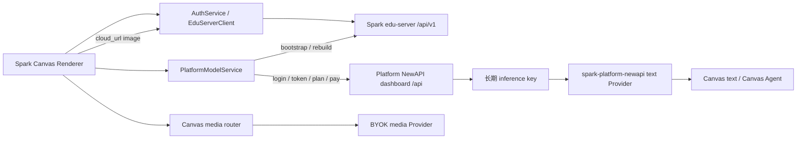

# Spark Canvas 共享 Spark 云、计费与上传契约审计

> 审计快照: 2026-07-17 | 代码基线: `6cfbfcd` | T-013 已冻结，本阶段不修改业务代码

## 1. 目的与结论

负责人已经确认 Spark Canvas 第一版继续共用原 Spark 的账户、余额、套餐、订单、支付、模型额度和上传空间，同时要求 BYOK 不受登录、余额或 Spark 云故障阻塞。本文件把这两个决定落实为一条可实施、可测试的技术边界。

结论先行：批准保留共享云是正确的模块处置，但当前实现还不能直接作为独立产品的发布契约。

1. 当前“Spark 平台模型”只创建一个 `modelType: text` 的 Anthropic 兼容 Provider。它能用于 Canvas 文本任务和 Canvas Agent，不进入图片/视频媒体路由；仓库里没有 Spark 托管图片或视频生成链。
2. 当前 Canvas 却会让大多数 BYOK 图片/视频模型的 `cloud_url` 输入先经过 Spark `/api/v1/upload`。文本任务带图时也默认走该路径。失败后虽尝试 base64，但不检查目标模型是否支持，不能证明 BYOK 真正独立。
3. Spark 云端用量与本地 `UsageLedgerService` 是两套账。前者是共享余额的权威账，后者只是本机 Agent Session token 观测；当前 UI 和总账尚未把两者清楚分开。
4. 支付没有客户端幂等键或订单状态查询，pending 只保存 plan 和旧订阅基线；上传返回的 `fileKey` 被立即丢弃，没有引用、去重、过期或删除闭环。
5. `stream:auth:token-refreshed` 会把 access token 和 refresh token 广播给所有应用窗口，但没有 Renderer 消费者；Platform Model 的支付、兑换等多数 IPC 也没有运行时 schema。

因此第一版可以保留现有后端，但 candidate/stable 之前必须落实本文件的 T-013。未明确扩展前，对外只能承诺“Spark 托管文本模型”；不能把共享账户和计费等同于已经具备 Spark 托管图片/视频。

## 2. 当前双服务架构

这是两个认证域，不是一枚 token 通吃全部接口：

| 域               | 凭据                                         | 用途                                            | 当前本地落点                                      |
| ---------------- | -------------------------------------------- | ----------------------------------------------- | ------------------------------------------------- |
| Spark Cloud Auth | access token + refresh token + Spark user ID | 登录、资料、上传、Platform bootstrap 和购买链接 | `SparkAgent.CloudAuth` + `cloud-auth-session.enc` |
| NewAPI 管理      | dashboard access token + NewAPI user ID      | 套餐、订阅、支付、兑换、日志和 API token 管理   | `newapi-spark-user-<id>-access-token`             |
| NewAPI 推理      | 长期 inference API key                       | `/v1/messages`、`/v1/models`                    | `newapi-spark-user-<id>-api-key`                  |
| BYOK             | 用户自己的 Provider API key                  | 第三方文本、图片、音频和视频接口                | 当前 `spark-agent` Provider vault                 |

目标本地身份仍按已冻结决策改为 `SparkCanvas.CloudAuth` 和 `spark-canvas` Provider vault，不读取旧 Keychain。后端 Spark user ID、余额和订单继续共用。

## 3. 完整接口库存

### 3.1 edu-server `/api/v1`

`EduServerClient.resolveUrl()` 会给下列相对路径统一增加 `/api/v1`：

| 方法与路径                                 | 当前用途                                        | 认证          |
| ------------------------------------------ | ----------------------------------------------- | ------------- |
| `GET /auth/captcha`                        | 图片验证码                                      | 公开          |
| `POST /auth/send-code`                     | 邮箱注册/登录验证码                             | 公开          |
| `POST /auth/register`                      | 注册并建立会话                                  | 公开          |
| `POST /auth/login`                         | 密码/验证码登录                                 | 公开          |
| `POST /auth/send-sms`                      | 短信验证码                                      | 公开          |
| `POST /auth/login-sms`                     | 短信登录/首次注册                               | 公开          |
| `GET /client-config`                       | 短信/微信能力开关                               | 公开          |
| `GET /auth/wechat/qr`                      | 微信登录二维码                                  | 公开          |
| `GET /auth/wechat/poll?state=...`          | 微信登录轮询                                    | 公开          |
| `POST /auth/wechat/bind-email/send-code`   | 微信账号绑定邮箱验证码                          | bind session  |
| `POST /auth/wechat/bind-email`             | 完成绑定并建立会话                              | bind session  |
| `POST /auth/refresh`                       | 刷新 Cloud Auth 会话                            | refresh token |
| `POST /auth/logout`                        | 撤销会话                                        | Bearer        |
| `GET /me`                                  | bootstrap/账户资料                              | Bearer        |
| `PUT /me`                                  | 更新昵称                                        | Bearer        |
| `GET /me/bind-status`                      | 查询绑定状态                                    | Bearer        |
| `POST /me/avatar`                          | 头像上传并落库                                  | Bearer        |
| `POST /auth/change-password`               | 修改密码                                        | Bearer        |
| `POST /upload`                             | Canvas 输入上传，返回 `fileKey/staticUrl/aiUrl` | Bearer        |
| `GET /wallet/purchase-links`               | 外部购买渠道                                    | Bearer        |
| `POST /platform-model/redeem-subscription` | 订阅类兑换码                                    | Bearer        |
| `POST /platform-model/bootstrap`           | 绑定/获取 NewAPI 用户、临时密码和 base URL      | Bearer        |
| `POST /platform-model/rebuild`             | NewAPI 登录失效后的重建                         | Bearer        |

桌面端对外暴露 22 个 `auth:*` IPC；其中 `auth:set-base-url` 当前固定报错，`auth:get-base-url` 和 `auth:bootstrap` 是本地编排，不新增服务端路径。

### 3.2 Platform NewAPI

| 方法与路径                           | 当前用途                                            | 凭据                            |
| ------------------------------------ | --------------------------------------------------- | ------------------------------- |
| `POST /api/user/login`               | 使用 bootstrap 返回的用户名/密码建立 cookie session | 用户名/密码                     |
| `GET /api/user/token`                | 换取 dashboard access token                         | session cookie + `New-Api-User` |
| `GET /api/user/self`                 | 校验管理会话、查询余额和累计消耗                    | dashboard token                 |
| `GET /api/user/models`               | 查询可用托管文本模型                                | dashboard token                 |
| `GET /api/subscription/plans`        | 套餐列表                                            | dashboard token                 |
| `GET /api/subscription/self`         | 当前订阅                                            | dashboard token                 |
| `GET /api/log/self?p=1&page_size=10` | 最近十条云端用量                                    | dashboard token                 |
| `GET /api/token/`                    | 查询 inference token                                | dashboard token                 |
| `POST /api/token/`                   | 创建 inference token                                | dashboard token                 |
| `POST /api/token/{id}/key`           | 读取完整 inference key                              | dashboard token                 |
| `POST /api/user/topup`               | 通用额度兑换码                                      | dashboard token                 |
| `POST /api/subscription/epay/pay`    | 创建 EPay 表单                                      | dashboard token                 |
| `GET /api/status`                    | 额度显示单位、汇率和符号                            | 公开                            |
| `GET /v1/models`                     | 校验 inference key                                  | inference key                   |
| `POST /v1/messages`                  | 托管文本推理                                        | inference key                   |

`registerPlatformModelIpc.ts` 暴露 11 个 `platform-model:*` IPC。当前只有模型偏好和购买链接 ID 有 Zod schema；支付、兑换等入口仍只靠 TypeScript 类型。

## 4. 三条执行路径的冻结边界

| 路径                | 登录要求                                 | 凭据来源                           | 输入传输                                                             | 计费权威                      | 允许故障回退                            |
| ------------------- | ---------------------------------------- | ---------------------------------- | -------------------------------------------------------------------- | ----------------------------- | --------------------------------------- |
| 本地能力/FFmpeg     | 否                                       | 无或本机工具凭据                   | 本地项目文件                                                         | 不产生 Spark 模型费用         | 只回退到同一免费本地能力                |
| BYOK 文本/媒体      | 否                                       | `spark-canvas` 本地 Provider vault | manifest 明示的 base64、Provider 原生上传或用户明确选择的 Spark 上传 | 第三方 Provider；本地只做观测 | 只能在同一 Provider、同一计费来源内重试 |
| Spark 托管文本      | 是；临时 Auth 故障可使用已验证的离线凭据 | Cloud Auth -> NewAPI inference key | 网关支持时优先内联；确需公网 URL 才用 Spark 上传                     | NewAPI 共享账户账本           | 不得切到 BYOK 或另一托管模型            |
| Spark 托管图片/视频 | 当前不存在                               | 未实现                             | 未实现                                                               | 未实现                        | 不得宣传或伪装成已支持                  |

强制不变量：

1. 每个任务在提交前固定 `billingSource`、`providerProfileId`、`modelId` 和输入传输策略，并随任务快照持久化。
2. 显式 Provider 不可用时直接失败。`MediaRouterService` 当前“指定 ID 未命中后选择第一个可用 Provider”的行为必须移除。
3. 未显式选择时优先本地/BYOK 默认 Provider；不得因为只剩托管 Provider 就自动扣 Spark 余额。首次选择托管模型必须有明确来源和费用提示。
4. 自动路由的候选池必须按计费域隔离。一个 router 不能同时包含 BYOK 与 Spark 托管候选，除非用户创建并确认了明确的跨计费策略；第一版不提供该策略。
5. 任何错误、限流、余额不足、登录失效或上传失败都不能改变 `billingSource`。

## 5. Auth 与托管凭据状态机

### 5.1 Cloud Auth

当前 Renderer 只有 `isAuthenticated: boolean`，`/me` 的网络错误也会显示为未登录，但 TokenStore 并未清空。目标至少区分：

| 状态             | 项目/BYOK | 托管推理                                   | 账户/支付/上传                |
| ---------------- | --------- | ------------------------------------------ | ----------------------------- |
| `guest`          | 可用      | 不可用                                     | 不可用                        |
| `validating`     | 可用      | 已验证缓存可继续                           | 暂停                          |
| `authenticated`  | 可用      | 可用                                       | 可用                          |
| `offline-cached` | 可用      | 仅允许账号匹配且近期验证过的 inference key | 不可管理账户，不创建上传/支付 |
| `expired`        | 可用      | 禁用并清理当前账号本地托管凭据             | 重新登录                      |

只有服务端明确拒绝 refresh/session 才进入 `expired`。DNS、超时和 5xx 只能进入 `offline-cached`，不能伪装成主动退出。

### 5.2 管理会话与推理会话

NewAPI dashboard token 当前单活，另一设备登录会使管理入口进入 `session_conflict`，但已签发的 inference key 仍可推理。目标状态必须拆开：

- `managementState`: `unbound | ready | conflict | unavailable`；
- `inferenceState`: `missing | validating | ready | quota_exhausted | revoked | unavailable`。

管理冲突不能把仍有效的推理标成失败；推理 key 失效也不能自动执行 `/platform-model/rebuild` 或接管另一设备。Spark Agent 与 Spark Canvas 共用账号时，稳定发布前必须取得服务端并发策略证据：至少保证两个产品可同时推理，并明确 dashboard token 是产品/设备隔离还是仍采用显式接管。

### 5.3 凭据边界

- Cloud Auth token、NewAPI dashboard token、临时用户名/密码和 inference key 只留在主进程/系统凭据库。
- 删除 `stream:auth:token-refreshed` 中的明文 token；Renderer 只接收“会话已刷新”的非敏感状态，或完全不接收该 stream。
- 新应用为 inference token 使用产品可识别的服务端名称，避免 `startsWith('Spark平台令牌')` 误选另一产品的恢复 token。共享余额不等于共享可撤销凭据。
- 账号切换按旧 owner 清理本地 dashboard/inference 凭据并禁用其 Provider；不得删除旧 Spark Agent 的 Keychain 或服务端 token。
- bootstrap 返回的 NewAPI `baseUrl` 必须是批准的 HTTPS host；生产环境拒绝 HTTP、userinfo、非标准端口、重定向越界和本机/私网目标。

## 6. 上传空间契约

### 6.1 当前真实行为

1. Operation Panel 除 xAI/Agnes 外默认 `cloud_url`；Inline Composer 的 auto 只对 xAI 选 base64，两处策略不一致。
2. 文本操作的 `selectedModel` 为空，也会默认 `cloud_url`，因此 BYOK 视觉文本任务会先尝试 Spark 上传。
3. `materializeCanvasTaskInputFiles()` 只上传 `image`；视频和音频本地输入不会被 materialize 成公网 URL。
4. 上传失败会尝试 base64，不校验 manifest 是否接受 base64。
5. `dataUrl` IPC 上限约 100 MB，`filePath` 会一次性 `readFile` 入内存；没有按 MIME/像素/时长的能力上限或并发限制。
6. 每次运行会重新上传，同一素材没有 hash 去重或幂等键。
7. 客户端只保留 `aiUrl`，丢弃 `fileKey`；项目删除、资产删除和任务取消都无法回收云对象。

### 6.2 目标传输选择

传输策略必须来自目标 model/capability manifest，而不是 `providerKind === 'xai'` 这类硬编码：

1. `inline_base64`：BYOK 默认优先，适合 Provider 明确支持且尺寸未超限的输入。
2. `provider_native_upload`：由该 BYOK Provider 自己的上传 API 返回 URL/file id，不经过 Spark。
3. `spark_cloud_url`：只有 manifest 要求公网 URL、用户已登录且任务明确选择该策略时才调用共享 Spark 上传。

URL-only BYOK 模型在未登录时应提示“登录后使用 Spark 上传”或选择另一个支持 base64/原生上传的模型；取消后任务保持原 Provider，不得换模型。Spark 上传是获批的可选能力，不是 BYOK 的隐藏前置条件。

### 6.3 生命周期与隐私

每个 Spark 上传结果必须保存：`fileKey`、owner Spark user ID、项目/资产/任务 ID、内容 hash、字节数、MIME、创建时间、用途、URL 到期时间和引用计数。后端契约还必须给出：

- 允许的 MIME、单文件/账号上限和并发限制；
- URL 是否公开、有效期和是否可续签；
- 去重/幂等语义；
- 取消、资产删除、项目永久删除和账号注销时的删除/保留规则；
- 服务端清理 API 或明确 TTL；没有任何删除或 TTL 证据时，真实用户影视素材不得进入 stable；
- 日志和任务诊断不得保存 base64、Bearer token、完整签名 URL 或可复用上传凭据。

客户端应流式读取大文件并在上传前按能力检查类型、大小、图片像素和视频时长；不能把 100 MB 字符串当作视频平台的通用边界。

## 7. 计费、支付和用量契约

### 7.1 两套用量必须分开

| 数据                               | 当前来源                                   | 权威含义                          |
| ---------------------------------- | ------------------------------------------ | --------------------------------- |
| Spark 余额、套餐消耗、最近十条日志 | NewAPI `/api/user/self`、subscription、log | 真实共享云账单                    |
| 本地 token/cost                    | `usage_ledger` / `UsageLedgerService`      | 本机 Agent Session 观测，不是账单 |
| Canvas 直接文本任务 usage          | OpenAI 路径部分解析；Anthropic 路径未解析  | 不完整的任务诊断                  |
| Canvas BYOK media                  | media task 结果                            | 没有统一价格或费用账本            |

设置页“用量统计”必须明确标为本地模型调用统计；账户页展示 Spark 云端账单。不能把本地估算与真实扣款相加，也不能在 `/api/status` 失败时静默套用 `$ / 500000` 默认值显示成可信金额。

每次托管调用应携带不含用户内容的 `product=spark-canvas`、client version、project/task request ID；服务端日志按 request ID 返回模型、额度变化和时间，客户端据此对账。云端仍是最终权威，本地记录只缓存上次已确认结果。

### 7.2 支付与兑换

当前支付只返回外部 POST form，客户端通过订阅 ID/到期时间轮询猜测是否成功。目标契约必须包含：

1. 创建支付返回 `orderId`、状态、金额的整数 minor unit、币种、过期时间和受控 payment action。
2. 客户端在发请求前持久化 payment intent 与 idempotency key；重复点击、超时重试和重启恢复只能得到同一订单。
3. 使用订单状态 endpoint/签名回调确认支付，不以“同 plan 已 active”作为唯一证据。
4. pending 保存 `orderId`，终态为 `paid | failed | expired | cancelled` 后清除；轮询有退避、总时限和手动刷新。
5. 支付 form action 和购买链接使用服务端配置的 HTTPS allowlist，不能只检查 `http/https` scheme。
6. 支付、兑换、token 创建、账号 rebuild 均不得由客户端自动重试；服务端支持幂等后才可用相同 key 重放。
7. 临时支付 HTML 必须在成功打开后尽快清除，并在下次启动清理残留；文件名、日志和错误不包含签名字段。

## 8. 超时、重试与故障降级

`NewApiClient` 当前 fetch 没有超时。目标统一规则：

| 操作                                         | 超时/重试                                          | 失败后行为                                   |
| -------------------------------------------- | -------------------------------------------------- | -------------------------------------------- |
| 公开配置、me、plans、subscription、usage GET | 有界超时；网络/5xx 最多有限退避重试                | 标为暂不可用，保留项目和 BYOK                |
| Cloud Auth refresh                           | 单飞；一次 refresh 后至多重放原请求一次            | 明确拒绝才过期，网络错进入离线态             |
| 托管推理                                     | 有界超时；结果未知时不自动重发付费请求             | 保留同一 Provider，交给用户显式重试          |
| 上传                                         | 有界超时；仅使用同一内容 hash/idempotency key 重放 | 不换 Provider；清理 partial 或等待服务端对账 |
| 支付、兑换、token 创建、rebuild              | 默认不自动重试                                     | 查询原 intent/订单，或要求用户再次确认       |
| BYOK                                         | 完全不依赖 Auth/Platform Model 健康检查            | 原 Provider 成功或明确失败                   |

任一共享云错误都不能阻塞项目列表、项目打开/保存、Provider 设置、BYOK 文本/图片/视频、FFmpeg 或本地导入导出。

## 9. 当前缺口与实施批次

### 9.1 发布阻塞项

| 严重度 | 当前缺口                                                            | 直接证据                                                                                |
| ------ | ------------------------------------------------------------------- | --------------------------------------------------------------------------------------- |
| P0     | BYOK 输入传输仍默认依赖 Spark 上传                                  | `CanvasOperationPanel.tsx`、`CanvasInlineAiComposer.tsx`、`canvasWorkspaceTaskInput.ts` |
| P0     | 显式媒体 Provider 未命中会静默选择另一个 Provider                   | `media-router.service.ts`                                                               |
| P0     | 明文 Auth token 广播给所有窗口                                      | `AuthService.handleTokenRefreshed()`                                                    |
| P0     | 上传 `fileKey` 丢失，无删除、TTL、引用或去重证据                    | `EduServerClient.uploadFile()` 及两个 materialize 实现                                  |
| P0     | 支付无订单 ID/幂等键，成功靠订阅变化推断                            | `PlatformModelService.pay/getSubscription()`                                            |
| P0     | NewAPI base URL 无生产 host/TLS 校验，所有管理 fetch 无超时         | `PlatformModelService.bootstrapInternal()`、`NewApiClient.ts`                           |
| P0     | 云端账与本地 Usage Ledger 语义混用，额度单位失败时静默回退          | `NewApiClient.getUsage()`、`SettingsView.UsageSection`                                  |
| P0     | 多数 Platform Model IPC 无运行时 request schema                     | `packages/protocol/src/schemas/index.ts`                                                |
| P1     | Cloud Auth 网络失败与真正退出在 UI 都表现为未登录                   | `AuthService.bootstrap()`、`AuthContext.tsx`                                            |
| P1     | 两产品复用模糊命名的长期 inference token，撤销/归因未隔离           | `NewApiClient.ensureApiKey()`                                                           |
| P1     | NewAPI dashboard token 单活会让 Spark Agent/Canvas 互相接管管理会话 | `NewApiClient.integration.test.ts`                                                      |
| P1     | 上传策略在 Operation Panel 与 Inline Composer 不一致，且只处理图片  | 两个 Renderer 调用点                                                                    |

### 9.2 实施顺序

| 顺序 | 批次                  | 退出条件                                                                         |
| ---: | --------------------- | -------------------------------------------------------------------------------- |
|    1 | 服务端契约取证        | 取得 Auth/NewAPI schema、上传生命周期、订单/幂等和多客户端策略                   |
|    2 | 凭据与 IPC 收口       | token 不进 Renderer；33 个 Auth/Platform request 全有 schema、窗口角色和脱敏错误 |
|    3 | 路由与计费域隔离      | BYOK/托管显式选择；任何错误不跨 Provider/计费域；auto router 分池                |
|    4 | manifest 驱动输入传输 | guest BYOK 不请求 Spark；base64/native/Spark upload 按能力选择                   |
|    5 | 上传生命周期          | `fileKey` 入账、幂等/去重、大小/MIME、TTL/删除和失败清理通过                     |
|    6 | 托管状态与多客户端    | Auth offline/expired、管理/推理状态拆分；双产品并行推理通过                      |
|    7 | 支付与用量对账        | 订单 ID/幂等/终态、云账/本地统计分栏、request ID 对账通过                        |

这些批次应在删除旧平台域之前完成，因为 Auth、Provider、Session 和 Canvas task 都依赖其结果；但不需要把共享后端代码复制进本仓库。

## 10. T-013 验收门

1. 未登录且 Spark 域名全部不可达时，BYOK 文本、带图文本、图片和视频各完成一条真实旅程，网络记录对 Spark 域为 0。
2. 显式 BYOK Provider 缺 Key、被禁用或调用失败时，任务失败且 Spark 余额、其他 Provider 调用数均不变。
3. 显式 Spark 托管文本任务只调用该托管 Provider；成功、余额不足、超时和结果未知都不切 BYOK。
4. Operation Panel、Inline Composer、批量任务和 Canvas Agent 使用同一计费来源与输入传输规则。
5. base64 模型不上传；Provider 原生上传不调用 Spark；Spark URL 模式会保存 `fileKey` 并通过 TTL/删除闭环。
6. 本地图片、音频、视频分别验证大小、MIME、取消、重试和内存上限；不支持的组合在上传前拒绝。
7. 两个窗口和两个项目并行时收不到任何 token；刷新后 Renderer 只能看到非敏感 Auth 状态。
8. Spark Agent 与 Spark Canvas 同账号可同时推理；一个产品的管理接管、退出和本地清理不删除另一产品凭据。
9. 支付重复点击、网络超时和重启恢复只产生一个订单；订单终态与订阅、余额完成服务端对账。
10. `/api/status`、usage 或日志不可用时 UI 显示“暂不可用”，不展示猜测货币/金额。
11. 恶意 bootstrap base URL、支付 URL、超大上传、未知 IPC payload 和跨账号 owner 都被拒绝。
12. 安装包只允许批准的 Auth、NewAPI、上传、支付和 Provider 域名；日志、任务快照、导出和 crash report 无 token/key/签名 URL。

## 11. 当前验证

2026-07-17 使用 Desktop Vitest 定向运行：

- `NewApiClient.test.ts`：11 个测试通过；
- `NewApiClient.integration.test.ts`：1 个 HTTP 集成测试通过；
- `PlatformModelService.test.ts`：10 个测试通过；
- `AuthService.test.ts`：8 个测试通过。

共 4 个文件、30 个测试通过。静态调用点复核还确认：生产代码只有一处创建 `managed: true` Provider；`stream:auth:token-refreshed` 没有 Renderer 消费者；Platform Model 11 个 IPC 只有 2 个进入 schema registry；上传 `fileKey` 除响应校验和类型外没有业务消费者。

这些测试证明当前客户端既有行为，不证明 T-013 已实施，也不替代真实服务端和打包应用验收。

## 12. 仍需外部证据

仓库没有 edu-server/NewAPI 服务端源码，以下不能由客户端测试替代：

- Cloud Auth token、refresh、账号切换和客户端产品识别的服务端 schema；
- NewAPI dashboard token 是否能按产品/设备并存，inference token 的撤销和产品归因；
- quota 原始单位、套餐金额单位、汇率来源和账单精度；
- `/upload` 的 MIME/大小、公开性、TTL、删除、去重、配额和服务端扫描策略；
- EPay 订单、幂等、回调签名、允许 host 和退款/失败状态；
- 托管网关是否完整支持 Anthropic base64 图片及 request ID/usage 返回。

这些证据是对应实施批次和 stable 的阻塞项，不阻塞本轮源码审计成稿。

## 13. 冻结结论

T-013“共享 Spark 云的路由、计费与上传隔离”由已确认的 D-005/D-006 直接导出，不新增账户体系：

- 继续共用原 Spark 账户、余额、套餐、订单、支付、额度和上传空间；
- BYOK、托管和本地路径在提交前固定，绝不跨计费域静默回退；
- Spark 上传保留但成为 manifest 驱动的显式策略，不是 BYOK 前置条件；
- 远端账单是 Spark 扣费权威，本地 Usage Ledger 只作观测；
- token 不进入 Renderer，所有 endpoint、IPC、支付和上传都采用默认拒绝、幂等和有界故障语义；
- 当前托管范围按源码限定为文本，图片/视频托管需另行扩展后端与媒体 Provider 契约。
